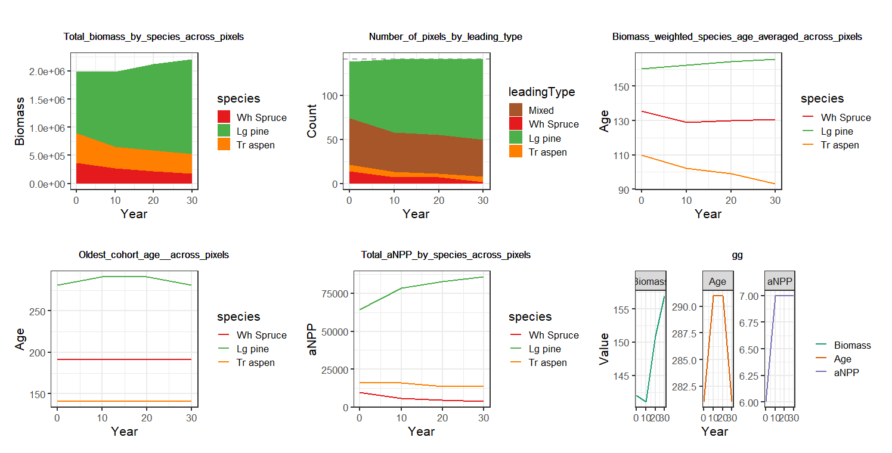

<!-- the following are text references used in captions for LaTeX compatibility -->

(ref:Biomass-core) *Biomass_core*

(ref:Biomass-borealdataPrep) *Biomass_borealDataPrep*

(ref:percent) %

(ref:sufficient-light) *sufficient light*

(ref:Abie-sp) *Abies sp.* (Abie_sp)

(ref:Pinu-sp) *Pinus sp.* (Pinu_sp)

(ref:Pice-eng) *Picea engelmannii* (Pice_eng)

(ref:Pice-gla) *Picea glauca* (Pice_gla)

(ref:Popu-sp) *Populus sp.* (Popu_sp)

(ref:Pseud-men) *Pseudotsuga menziesii* (Pseu_men)


[](https://github.com/PredictiveEcology/Biomass_core/commit/b3dc7c6b8dc3e07fa07304c7008255e83d20abe7)

[](https://github.com/PredictiveEcology/Biomass_core/issues)

#### Authors:

Yong Luo <yluo1@lakeheadu.ca> [aut], Eliot J B McIntire <eliot.mcintire@nrcan-rncan.gc.ca> [aut, cre], Ceres Barros <ceres.barros@ubc.ca> [aut], Alex M. Chubaty <achubaty@for-cast.ca> [aut], Ian Eddy <ian.eddy@nrcan-rncan.gc.ca> [ctb], Jean Marchal <jean.d.marchal@gmail.com> [ctb]
<!-- ideally separate authors with new lines, '\n' not working -->

**This documentation is work in progress. Potential discrepancies and omissions
may exist for the time being. If you find any, contact us using the "Get help"
link above.**

## Module Overview

### Quick links

-   [General functioning](#general-functioning)

-   [List of input objects](#inputs-list)

-   [List of parameters](#params-list)

-   [List of outputs](#outputs-list)

-   [Simulation flow and module events](#sim-flow)

### Summary

LandR *Biomass_core* (hereafter *Biomass_core*) is the core forest succession
simulation module of the LandR ecosystem of `SpaDES` modules [see
@ChubatyMcIntire2019]. It simulates tree cohort ageing, growth, mortality and
competition for light resources, as well as seed dispersal (Fig.
\@ref(fig:fig-Biomass-core)), in a spatially explicit manner and using a yearly
time step. The model is based on the LANDIS-II Biomass Succession Extension
v.3.2.1 [LBSE, @SchellerMiranda2015], with a few changes (see [Differences
between *Biomass_core* and LBSE](#biomass-core-vs-lbse)). Nonetheless, the
essential functioning of the succession model still largely follows its
LANDIS-II counterpart, and we refer the reader to the corresponding LBSE manual
[@SchellerMiranda2015] for a detailed reading of the mechanisms implemented in
the model.

<div class="figure" style="text-align: center">

<p class="caption">(\#fig:fig-Biomass-core)(ref:Biomass-core) simulates tree cohort growth, mortality, recruitment and dispersal dynamics, as a function of  cohort ageing and competition for light (shading) and space, as well as disturbances like fire (simulated using other modules).</p>
</div>

### Links to other modules {#links-modules}

*Biomass_core* is intended to be used with data/calibration modules, disturbance
modules and validation modules, amongst others. The following is a list of the
modules most commonly used with *Biomass_core*. For those not yet in the [LandR
Manual](https://landr-manual.predictiveecology.org/) see the individual module's
documentation (`.Rmd` file) available in its repository.

See [here](https://rpubs.com/PredictiveEcology/LandR_Module_Ecosystem) for all
available modules and select *Biomass_core* from the drop-down menu to see
linkages.

**Data and calibration modules:**

-   [*Biomass_speciesData*](https://github.com/PredictiveEcology/Biomass_speciesData):
grabs and merges several sources of species cover data, making species
percent cover ((ref:percent) cover) layers used by other LandR Biomass
modules. Default source data spans the entire Canadian territory;

-   [*Biomass_borealDataPrep*](https://github.com/PredictiveEcology/Biomass_borealDataPrep):
prepares all parameters and inputs (including initial landscape conditions)
that *Biomass_core* needs to run a realistic simulation. Default
values/inputs produced are relevant for boreal forests of Western Canada;

-   [*Biomass_speciesParameters*](https://github.com/PredictiveEcology/Biomass_speciesParameters):
calibrates four-species level traits using permanent sample plot data (i.e.,
repeated tree biomass measurements) across Western Canada.

**Disturbance-related modules:**

-   [*Biomass_regeneration*](https://github.com/PredictiveEcology/Biomass_regeneration):
simulates cohort biomass responses to stand-replacing fires (as in LBSE),
including cohort mortality and regeneration through resprouting and/or
serotiny;

-   [*Biomass_regenerationPM*](https://github.com/PredictiveEcology/Biomass_regenerationPM):
like *Biomass_regeneration*, but allowing partial mortality. Based on the
LANDIS-II Dynamic Fuels & Fire System extension [@SturtevantEtAl2018];

-   *fireSense*: climate- and land-cover-sensitive fire model simulating fire
ignition, escape and spread processes as a function of climate and
land-cover. Includes built-in parameterisation of these processes using
climate, land-cover, fire occurrence and fire perimeter data. Requires using
*Biomass_regeneration* or *Biomass_regenerationPM*. See modules prefixed
"*fireSense\_*" at <https://github.com/PredictiveEcology/>;

-   [*LandMine*](https://github.com/PredictiveEcology/LandMine): wildfire
ignition and cover-sensitive wildfire spread model based on a fire return
interval input. Requires using *Biomass_regeneration* or
*Biomass_regenerationPM*;

-   [*scfm*](https://github.com/PredictiveEcology/scfm): spatially explicit fire
spread module parameterised and modelled as a stochastic three-part process
of ignition, escape, and spread. Requires using *Biomass_regeneration* or
*Biomass_regenerationPM*.

**Validation modules:**

-   [*Biomass_validationKNN*](https://github.com/PredictiveEcology/Biomass_validationKNN):
calculates two validation metrics (mean absolute deviation and sum of
negative log-likelihoods) on species presences/absences and biomass-related
properties across the simulated landscape. By default, it uses an
independent dataset of species (ref:percent) cover and stand biomass for
2011, assuming that this is a second snapshot of the landscape.

## Module manual

### General functioning {#general-functioning}

*Biomass_core* is a forest landscape model based on the LANDIS-II Biomass
Succession Extension v.3.2.1 model [LBSE, @SchellerMiranda2015]. It is the core
forest succession model of the LandR ecosystem of `SpaDES` modules. Similarly to
LBSE, *Biomass_core* simulates changes in tree cohort aboveground biomass
($g/m^2$) by calculating growth, mortality and recruitment as functions of pixel
and species characteristics, competition and disturbances (Fig.
\@ref(fig:fig-Biomass-core)). Note that, by default, cohorts are unique
combinations of species and age, but this can be changed via the
`cohortDefinitionCols` parameter (see [List of parameters](#params-list)).

Specifically, cohort growth is driven by both invariant (growth shape parameter,
`growthcurve`) and spatio-temporally varying species traits (maximum biomass,
`maxB`, and maximum annual net primary productivity, `maxANPP`), while
background mortality (i.e., not caused by disturbances) depends only on
invariant species traits (`longevity` and mortality shape parameter,
`mortalityshape`). All these five traits directly influence the realised shape
of species growth curves, by determining how fast they grow (`growthcurve` and
`maxANPP`), how soon age mortality starts with respect to longevity
(`mortalityshape`) and the biomass a cohort can potentially achieve (`maxB`).

Cohort recruitment is determined by available "space" (i.e., pixel shade),
invariant species traits (regeneration mode, `postfireregen`, age at maturity,
`sexualmature`, shade tolerance, `shadetolerance`) and a third spatio-temporally
varying trait (species establishment probability, `establishprob`, called SEP
hereafter). The available "growing space" is calculated as the species' `maxB`
minus the occupied biomass (summed across other cohorts in the pixel). If there
is "space", a cohort can establish from one of three recruitment modes:
serotiny, resprouting and germination.

Disturbances (e.g., fire) can cause cohort mortality and trigger
post-disturbance regeneration. Two post-disturbance regeneration mechanisms have
been implemented, following LBSE: serotiny and resprouting
[@SchellerMiranda2015]. Post-disturbance mortality and regeneration only occur
in response to fire and are simulated in two separate, but interchangeable
modules, *Biomass_regeneration* and *Biomass_regenerationPM* that differ with
respect to the level of post-fire mortality they simulate (complete or partial
mortality, respectively).

Cohort germination (also called cohort establishment) occurs if seeds are
available from local sources (the pixel), or via seed dispersal. Seed dispersal
can be of three modes: 'no dispersal', 'universal dispersal' (arguably, only
interesting for dummy case studies) or 'ward dispersal' [@SchellerMiranda2015].
Briefly, the 'ward dispersal' algorithm describes a flexible kernel that
calculates the probability of a species colonising a neighbour pixel as a
function of distance from the source and dispersal-related (and invariant)
species traits, and is used by default.

Finally, both germination and regeneration success depend on the species'
probability of germination in a given pixel ([probabilities of
germination](#prob-germ)).

We refer the reader to @SchellerMiranda2015, @SchellerDomingo2011 and
@SchellerDomingo2012 for further details with respect to the above mentioned
mechanisms implemented in *Biomass_core*. In a later section of this manual, we
highlight existing [differences between *Biomass_core* and
LBSE](#biomass-core-vs-lbse), together with [comparisons between the two
modules](#biomass-core-vs-lbse-comparisons).

### Initialisation, inputs and parameters {#init-inputs-params}

To initialise and simulate forest dynamics in any given landscape,
*Biomass_core* requires a number of inputs and parameters namely:

-   [initial cohort biomass and age](#initial-objs) values across the landscape;

-   [invariant species traits](#invariant-traits) values;

-   [spatio-temporally varying species traits](#varying-traits) values (or just
spatially-varying);

-   [location- (ecolocation-) specific parameters](#ecolocation-traits);

-   and the [probabilities of germination](#prob-germ) given a species' shade
tolerance and site shade.

These are detailed below and in the [full list of input objects](#inputs-list).
The *Biomass_borealDataPrep* module manual also provides information about the
estimation of many of these traits/inputs from available data, or their
adjustment using published values or our best knowledge of boreal forest
dynamics in Western Canada.

Unlike the initialisation in LBSE[^biomass_core-1], *Biomass_core* initialises
the simulation using data-derived initial cohort biomass and age. This
information is ideally supplied by data and calibration modules like
*Biomass_borealDataPrep* ([Links to other modules](#links-modules)), but
*Biomass_core* can also initialise itself using theoretical data.

Similarly, although *Biomass_core* can create all necessary traits and
parameters using theoretical values, for realistic simulations these should be
provided by data and calibration modules, like *Biomass_borealDataPrep* and
*Biomass_speciesParameters*. We advise future users and developers to become
familiar with these data modules and then try to create their own modules (or
modify existing ones) for their purpose.

[^biomass_core-1]: in LBSE the initialisation consists in "iterat[ing] the
number of time steps equal to the maximum cohort age for each site",
beginning at 0 minus *t* (*t =* oldest cohort age) and adding cohorts at the
appropriate time until the initial simulation time is reached (0)
[@SchellerMiranda2015].

#### Initial cohort biomass and age {#initial-objs}

Initial cohort biomass and age are derived from stand biomass (`biomassMap`
raster layer), stand age (`standAgeMap` raster layer) and species (ref:percent)
cover (`speciesLayers` raster layers) data (see Table
\@ref(tab:moduleInputs2-Biomass-core)) and formatted into the `cohortData`
object. The `cohortData` table is a central simulation object that tracks the
current year's cohort biomass, age, mortality (lost biomass) and aboveground net
primary productivity (ANPP) per species and pixel group (`pixelGroup`). At the
start of the simulation, `cohortData` will not have any values of cohort
mortality or ANPP.

Each `pixelGroup` is a collection of pixels that share the same ecolocation
(coded in the `ecoregionMap` raster layer) and the same cohort composition. By
default, an ecolocation is a combination of land-cover and ecological zonation
(see `ecoregionMap` in the [full list of inputs](#inputs-list)) and unique
cohort compositions are defined as unique combinations of species, age and
biomass. The `cohortData` table is therefore always associated with the current
year's `pixelGroupMap` raster layer, which provides the spatial location of all
`pixelGroups`, allowing to "spatialise" cohort information and dynamics (e.g.,
dispersal) on a pixel by pixel basis (see also
[Hashing](#biomass-core-vs-lbse-enhan2)).

The user, or another module, may provide initial `cohortData` and
`pixelGroupMap` objects to start the simulation, or the input objects necessary
to produce them: a study area polygon (`studyArea`), the `biomassMap`,
`standAgeMap`, `speciesLayers` and `ecoregionMap` raster layers (see the [list
of input objects](#inputs-list) for more detail).

#### Invariant species traits {#invariant-traits}

These are spatio-temporally constant traits that mostly influence population
dynamics (e.g., growth, mortality, dispersal) and responses to fire (fire
tolerance and regeneration).

By default, *Biomass_core* obtains trait values from available LANDIS-II tables
(see Table \@ref(tab:moduleInputs2-Biomass-core)), but traits can be
adjusted/supplied by the user or by other modules. For instance, using
*Biomass_borealDataPrep* will adjust some trait values for Western Canadian
boreal forests [e.g., longevity values are adjusted following
@BurtonCumming1995], while using *Biomass_speciesParameters* calibrates the
`growthcurve` and `mortalityshape` parameters and estimates two additional
species traits (`inflationFactor` and `mANPPproportion`) to calibrate `maxB` and
`maxANPP` (respectively).

Table \@ref(tab:invariantSpptraits) shows an example of a table of invariant
species traits. Note that *Biomass_core* (alone) requires all the columns Table
\@ref(tab:invariantSpptraits) in to be present, with the exception of
`firetolerance`, `postfireregen`, `resproutprob`, `resproutage_min` and
`resproutage_max`, which are used by the post-fire regeneration modules
(*Biomass_regeneration* and *Biomass_regenerationPM*).

Please see @SchellerDomingo2011 [p.18] and @SchellerMiranda2015 [p.16] for
further detail.

\newpage
\blandscape

<table>
<caption>(\#tab:invariantSpptraits)Example of an invariant species traits table (the `species` table object in the module), with species (ref:Abie-sp), (ref:Pice-eng), (ref:Pice-gla), (ref:Pinu-sp), (ref:Popu-sp) and (ref:Pseud-men).  Note that these are theoretical values.</caption>
 <thead>
  <tr>
   <th style="text-align:left;"> speciesCode </th>
   <th style="text-align:right;"> longevity </th>
   <th style="text-align:right;"> sexualmature </th>
   <th style="text-align:right;"> shadetolerance </th>
   <th style="text-align:right;"> firetolerance </th>
   <th style="text-align:left;"> postfireregen </th>
   <th style="text-align:right;"> resproutprob </th>
   <th style="text-align:right;"> resproutage_min </th>
   <th style="text-align:right;"> resproutage_max </th>
   <th style="text-align:right;"> seeddistance_eff </th>
   <th style="text-align:right;"> seeddistance_max </th>
   <th style="text-align:right;"> mortalityshape </th>
   <th style="text-align:right;"> growthcurve </th>
  </tr>
 </thead>
<tbody>
  <tr>
   <td style="text-align:left;"> Abie_sp </td>
   <td style="text-align:right;"> 200 </td>
   <td style="text-align:right;"> 20 </td>
   <td style="text-align:right;"> 2.3 </td>
   <td style="text-align:right;"> 1 </td>
   <td style="text-align:left;"> none </td>
   <td style="text-align:right;"> 0.0 </td>
   <td style="text-align:right;"> 0 </td>
   <td style="text-align:right;"> 0 </td>
   <td style="text-align:right;"> 25 </td>
   <td style="text-align:right;"> 100 </td>
   <td style="text-align:right;"> 15 </td>
   <td style="text-align:right;"> 0 </td>
  </tr>
  <tr>
   <td style="text-align:left;"> Pice_eng </td>
   <td style="text-align:right;"> 460 </td>
   <td style="text-align:right;"> 30 </td>
   <td style="text-align:right;"> 2.1 </td>
   <td style="text-align:right;"> 2 </td>
   <td style="text-align:left;"> none </td>
   <td style="text-align:right;"> 0.0 </td>
   <td style="text-align:right;"> 0 </td>
   <td style="text-align:right;"> 0 </td>
   <td style="text-align:right;"> 30 </td>
   <td style="text-align:right;"> 250 </td>
   <td style="text-align:right;"> 15 </td>
   <td style="text-align:right;"> 1 </td>
  </tr>
  <tr>
   <td style="text-align:left;"> Pice_gla </td>
   <td style="text-align:right;"> 400 </td>
   <td style="text-align:right;"> 30 </td>
   <td style="text-align:right;"> 1.6 </td>
   <td style="text-align:right;"> 2 </td>
   <td style="text-align:left;"> none </td>
   <td style="text-align:right;"> 0.0 </td>
   <td style="text-align:right;"> 0 </td>
   <td style="text-align:right;"> 0 </td>
   <td style="text-align:right;"> 100 </td>
   <td style="text-align:right;"> 303 </td>
   <td style="text-align:right;"> 15 </td>
   <td style="text-align:right;"> 1 </td>
  </tr>
  <tr>
   <td style="text-align:left;"> Pinu_sp </td>
   <td style="text-align:right;"> 150 </td>
   <td style="text-align:right;"> 15 </td>
   <td style="text-align:right;"> 1.0 </td>
   <td style="text-align:right;"> 2 </td>
   <td style="text-align:left;"> serotiny </td>
   <td style="text-align:right;"> 0.0 </td>
   <td style="text-align:right;"> 0 </td>
   <td style="text-align:right;"> 0 </td>
   <td style="text-align:right;"> 30 </td>
   <td style="text-align:right;"> 100 </td>
   <td style="text-align:right;"> 15 </td>
   <td style="text-align:right;"> 0 </td>
  </tr>
  <tr>
   <td style="text-align:left;"> Popu_sp </td>
   <td style="text-align:right;"> 140 </td>
   <td style="text-align:right;"> 20 </td>
   <td style="text-align:right;"> 1.0 </td>
   <td style="text-align:right;"> 1 </td>
   <td style="text-align:left;"> resprout </td>
   <td style="text-align:right;"> 0.5 </td>
   <td style="text-align:right;"> 10 </td>
   <td style="text-align:right;"> 70 </td>
   <td style="text-align:right;"> 200 </td>
   <td style="text-align:right;"> 5000 </td>
   <td style="text-align:right;"> 25 </td>
   <td style="text-align:right;"> 0 </td>
  </tr>
  <tr>
   <td style="text-align:left;"> Pseu_men </td>
   <td style="text-align:right;"> 525 </td>
   <td style="text-align:right;"> 25 </td>
   <td style="text-align:right;"> 2.0 </td>
   <td style="text-align:right;"> 3 </td>
   <td style="text-align:left;"> none </td>
   <td style="text-align:right;"> 0.0 </td>
   <td style="text-align:right;"> 0 </td>
   <td style="text-align:right;"> 0 </td>
   <td style="text-align:right;"> 100 </td>
   <td style="text-align:right;"> 500 </td>
   <td style="text-align:right;"> 15 </td>
   <td style="text-align:right;"> 1 </td>
  </tr>
</tbody>
</table>

\elandscape

#### Spatio-temporally varying species traits {#varying-traits}

These traits vary between species, by ecolocation and, potentially, by year if
the `year` column is not omitted and several years exist (in which case last
year's values up to the current simulation year are always used). They are
maximum biomass, `maxB`, maximum above-ground net primary productivity,
`maxANPP`, and species establishment probability, SEP (called `establishprob` in
the module). By default, *Biomass_core* assigns theoretical values to these
traits, and thus we recommend using *Biomass_borealDataPrep* to obtain realistic
trait values derived from data (by default, pertinent for Canadian boreal forest
applications), or passing a custom table directly. *Biomass_speciesParameters*
further calibrates `maxB` and `maxANPP` by estimating two additional invariant
species traits (`inflationFactor` and `mANPPproportion`; also for Western
Canadian forests). See Table \@ref(tab:varyingSpptraits) for an example.


<table>
<caption>(\#tab:varyingSpptraits)Example of a spatio-temporally varying species traits table (the `speciesEcoregion` table object in the module), with two ecolocations (called `ecoregionGroups`) and species (ref:Abie-sp), (ref:Pice-eng), (ref:Pice-gla), (ref:Pinu-sp), (ref:Popu-sp) and (ref:Pseud-men). If a simulation runs for 10 year using this table, trait values from year 2 would be used during simulation years 2-10.</caption>
 <thead>
  <tr>
   <th style="text-align:left;"> ecoregionGroup </th>
   <th style="text-align:left;"> speciesCode </th>
   <th style="text-align:right;"> establishprob </th>
   <th style="text-align:right;"> maxB </th>
   <th style="text-align:right;"> maxANPP </th>
   <th style="text-align:right;"> year </th>
  </tr>
 </thead>
<tbody>
  <tr>
   <td style="text-align:left;"> 1_03 </td>
   <td style="text-align:left;"> Abie_sp </td>
   <td style="text-align:right;"> 1.000 </td>
   <td style="text-align:right;"> 8567 </td>
   <td style="text-align:right;"> 285 </td>
   <td style="text-align:right;"> 1 </td>
  </tr>
  <tr>
   <td style="text-align:left;"> 1_03 </td>
   <td style="text-align:left;"> Pice_eng </td>
   <td style="text-align:right;"> 0.983 </td>
   <td style="text-align:right;"> 10156 </td>
   <td style="text-align:right;"> 305 </td>
   <td style="text-align:right;"> 1 </td>
  </tr>
  <tr>
   <td style="text-align:left;"> 1_03 </td>
   <td style="text-align:left;"> Popu_sp </td>
   <td style="text-align:right;"> 0.737 </td>
   <td style="text-align:right;"> 8794 </td>
   <td style="text-align:right;"> 293 </td>
   <td style="text-align:right;"> 1 </td>
  </tr>
  <tr>
   <td style="text-align:left;"> 1_03 </td>
   <td style="text-align:left;"> Pseu_men </td>
   <td style="text-align:right;"> 1.000 </td>
   <td style="text-align:right;"> 17534 </td>
   <td style="text-align:right;"> 132 </td>
   <td style="text-align:right;"> 1 </td>
  </tr>
  <tr>
   <td style="text-align:left;"> 1_09 </td>
   <td style="text-align:left;"> Abie_sp </td>
   <td style="text-align:right;"> 0.112 </td>
   <td style="text-align:right;"> 1499 </td>
   <td style="text-align:right;"> 50 </td>
   <td style="text-align:right;"> 1 </td>
  </tr>
  <tr>
   <td style="text-align:left;"> 1_09 </td>
   <td style="text-align:left;"> Pice_gla </td>
   <td style="text-align:right;"> 0.302 </td>
   <td style="text-align:right;"> 3143 </td>
   <td style="text-align:right;"> 102 </td>
   <td style="text-align:right;"> 1 </td>
  </tr>
  <tr>
   <td style="text-align:left;"> 1_09 </td>
   <td style="text-align:left;"> Pinu_sp </td>
   <td style="text-align:right;"> 0.714 </td>
   <td style="text-align:right;"> 2569 </td>
   <td style="text-align:right;"> 86 </td>
   <td style="text-align:right;"> 1 </td>
  </tr>
  <tr>
   <td style="text-align:left;"> 1_09 </td>
   <td style="text-align:left;"> Popu_sp </td>
   <td style="text-align:right;"> 0.607 </td>
   <td style="text-align:right;"> 3292 </td>
   <td style="text-align:right;"> 110 </td>
   <td style="text-align:right;"> 1 </td>
  </tr>
  <tr>
   <td style="text-align:left;"> 1_09 </td>
   <td style="text-align:left;"> Pseu_men </td>
   <td style="text-align:right;"> 0.997 </td>
   <td style="text-align:right;"> 6020 </td>
   <td style="text-align:right;"> 45 </td>
   <td style="text-align:right;"> 1 </td>
  </tr>
  <tr>
   <td style="text-align:left;"> 1_03 </td>
   <td style="text-align:left;"> Abie_sp </td>
   <td style="text-align:right;"> 0.989 </td>
   <td style="text-align:right;"> 8943 </td>
   <td style="text-align:right;"> 225 </td>
   <td style="text-align:right;"> 2 </td>
  </tr>
  <tr>
   <td style="text-align:left;"> 1_03 </td>
   <td style="text-align:left;"> Pice_eng </td>
   <td style="text-align:right;"> 0.985 </td>
   <td style="text-align:right;"> 9000 </td>
   <td style="text-align:right;"> 315 </td>
   <td style="text-align:right;"> 2 </td>
  </tr>
  <tr>
   <td style="text-align:left;"> 1_03 </td>
   <td style="text-align:left;"> Popu_sp </td>
   <td style="text-align:right;"> 0.600 </td>
   <td style="text-align:right;"> 8600 </td>
   <td style="text-align:right;"> 273 </td>
   <td style="text-align:right;"> 2 </td>
  </tr>
  <tr>
   <td style="text-align:left;"> 1_03 </td>
   <td style="text-align:left;"> Pseu_men </td>
   <td style="text-align:right;"> 1.000 </td>
   <td style="text-align:right;"> 13534 </td>
   <td style="text-align:right;"> 142 </td>
   <td style="text-align:right;"> 2 </td>
  </tr>
  <tr>
   <td style="text-align:left;"> 1_09 </td>
   <td style="text-align:left;"> Abie_sp </td>
   <td style="text-align:right;"> 0.293 </td>
   <td style="text-align:right;"> 2099 </td>
   <td style="text-align:right;"> 45 </td>
   <td style="text-align:right;"> 2 </td>
  </tr>
  <tr>
   <td style="text-align:left;"> 1_09 </td>
   <td style="text-align:left;"> Pice_gla </td>
   <td style="text-align:right;"> 0.745 </td>
   <td style="text-align:right;"> 3643 </td>
   <td style="text-align:right;"> 90 </td>
   <td style="text-align:right;"> 2 </td>
  </tr>
  <tr>
   <td style="text-align:left;"> 1_09 </td>
   <td style="text-align:left;"> Pinu_sp </td>
   <td style="text-align:right;"> 0.500 </td>
   <td style="text-align:right;"> 2569 </td>
   <td style="text-align:right;"> 80 </td>
   <td style="text-align:right;"> 2 </td>
  </tr>
  <tr>
   <td style="text-align:left;"> 1_09 </td>
   <td style="text-align:left;"> Popu_sp </td>
   <td style="text-align:right;"> 0.670 </td>
   <td style="text-align:right;"> 3262 </td>
   <td style="text-align:right;"> 111 </td>
   <td style="text-align:right;"> 2 </td>
  </tr>
  <tr>
   <td style="text-align:left;"> 1_09 </td>
   <td style="text-align:left;"> Pseu_men </td>
   <td style="text-align:right;"> 1.000 </td>
   <td style="text-align:right;"> 6300 </td>
   <td style="text-align:right;"> 43 </td>
   <td style="text-align:right;"> 2 </td>
  </tr>
</tbody>
</table>

#### Ecolocation-specific parameters -- minimum relative biomass {#ecolocation-traits}

Minimum relative biomass (`minRelativeB`) is the only ecolocation-specific
parameter used in *Biomass_core*. It is used to determine the shade level in
each pixel (i.e., site shade) with respect to the total potential maximum
biomass for that pixel (i.e., the sum of all `maxB` values in the pixel's
ecolocation). If relative biomass in the stand (with regards to the total
potential maximum biomass) is above the minimum relative biomass thresholds, the
pixel is assigned that threshold's site shade value [@SchellerMiranda2015].

The shade level then influences the germination and regeneration of new cohorts,
depending on their shade tolerance (see [Probabilities of
germination](#prob-germ)).

Site shade varies from X0 (no shade) to X5 (maximum shade). By default,
*Biomass_core* uses the same minimum realtive biomass threshold values across
all ecolocations, adjusted from a [publicly available LANDIS-II
table](https://github.com/dcyr/LANDIS-II_IA_generalUseFiles) to better reflect
Western Canada boreal forest dynamics (see Table \@ref(tab:minRelB)).
*Biomass_borealDataPrep* does the same adjustment by default. As with other
inputs, these values can be adjusted by using other modules or by passing
user-defined tables.

<table>
<caption>(\#tab:minRelB)Example of a minimum relative biomass table (the `minRelativeB` table object in the module), with two ecolocations (`ecoregionGroups`) sharing the same values</caption>
 <thead>
  <tr>
   <th style="text-align:left;"> ecoregionGroup </th>
   <th style="text-align:right;">  </th>
   <th style="text-align:right;">  </th>
   <th style="text-align:right;">  </th>
   <th style="text-align:right;">  </th>
   <th style="text-align:right;">  </th>
  </tr>
 </thead>
<tbody>
  <tr>
   <td style="text-align:left;"> 1_03 </td>
   <td style="text-align:right;"> 0.15 </td>
   <td style="text-align:right;"> 0.25 </td>
   <td style="text-align:right;"> 0.5 </td>
   <td style="text-align:right;"> 0.75 </td>
   <td style="text-align:right;"> 0.85 </td>
  </tr>
  <tr>
   <td style="text-align:left;"> 1_09 </td>
   <td style="text-align:right;"> 0.15 </td>
   <td style="text-align:right;"> 0.25 </td>
   <td style="text-align:right;"> 0.5 </td>
   <td style="text-align:right;"> 0.75 </td>
   <td style="text-align:right;"> 0.85 </td>
  </tr>
</tbody>
</table>

#### Probabilities of germination {#prob-germ}

A species' probability of germination results from the combination of its shade
tolerance level (an invariant species trait in the `species` table; Table
\@ref(tab:invariantSpptraits)) and the site shade [defined by the amount of
biomass in the pixel -- see [minimum relative biomass
parameter](#ecolocation-traits) and @SchellerMiranda2015,p.14]. By default, both
*Biomass_core* and *Biomass_borealDataPrep* use a publicly available LANDIS-II
table (called `sufficientLight` in the module; Table \@ref(tab:suffLight)).

<table>
<caption>(\#tab:suffLight)Default species probability of germination values used by (ref:Biomass-core) and (ref:Biomass-borealdataPrep). Columns X0-X5 are different site shade levels and each line has the probability of germination for each site shade and species shade tolerance combination.</caption>
 <thead>
  <tr>
   <th style="text-align:left;"> species shade tolerance </th>
   <th style="text-align:right;"> X0 </th>
   <th style="text-align:right;"> X1 </th>
   <th style="text-align:right;"> X2 </th>
   <th style="text-align:right;"> X3 </th>
   <th style="text-align:right;"> X4 </th>
   <th style="text-align:right;"> X5 </th>
  </tr>
 </thead>
<tbody>
  <tr>
   <td style="text-align:left;"> 1 </td>
   <td style="text-align:right;"> 1 </td>
   <td style="text-align:right;"> 0 </td>
   <td style="text-align:right;"> 0 </td>
   <td style="text-align:right;"> 0 </td>
   <td style="text-align:right;"> 0 </td>
   <td style="text-align:right;"> 0 </td>
  </tr>
  <tr>
   <td style="text-align:left;"> 2 </td>
   <td style="text-align:right;"> 1 </td>
   <td style="text-align:right;"> 1 </td>
   <td style="text-align:right;"> 0 </td>
   <td style="text-align:right;"> 0 </td>
   <td style="text-align:right;"> 0 </td>
   <td style="text-align:right;"> 0 </td>
  </tr>
  <tr>
   <td style="text-align:left;"> 3 </td>
   <td style="text-align:right;"> 1 </td>
   <td style="text-align:right;"> 1 </td>
   <td style="text-align:right;"> 1 </td>
   <td style="text-align:right;"> 0 </td>
   <td style="text-align:right;"> 0 </td>
   <td style="text-align:right;"> 0 </td>
  </tr>
  <tr>
   <td style="text-align:left;"> 4 </td>
   <td style="text-align:right;"> 1 </td>
   <td style="text-align:right;"> 1 </td>
   <td style="text-align:right;"> 1 </td>
   <td style="text-align:right;"> 1 </td>
   <td style="text-align:right;"> 0 </td>
   <td style="text-align:right;"> 0 </td>
  </tr>
  <tr>
   <td style="text-align:left;"> 5 </td>
   <td style="text-align:right;"> 0 </td>
   <td style="text-align:right;"> 0 </td>
   <td style="text-align:right;"> 1 </td>
   <td style="text-align:right;"> 1 </td>
   <td style="text-align:right;"> 1 </td>
   <td style="text-align:right;"> 1 </td>
  </tr>
</tbody>
</table>

#### Other module inputs {#other-inputs}

The remaining module input objects either do not directly influence the basic
mechanisms implemented in *Biomass_core* (e.g., `sppColorVect` and
`studyAreaReporting` are only used for plotting purposes), are objects that keep
track of a property/process in the module (e.g., `lastReg` is a counter of the
last year when regeneration occurred), or define the study area for the
simulation (e.g., `studyArea` and `rasterToMatch`).

The next section provides a complete list of all input objects, including those
already mentioned above.

### List of input objects {#inputs-list}

All of *Biomass_core*'s input objects have (theoretical) defaults that are
produced automatically by the module[^biomass_core-2]. We suggest that new users
run *Biomass_core* by itself supplying only a `studyArea` polygon, before
attempting to supply their own or combining *Biomass_core* with other modules.
This will enable them to become familiar with all the input objects in a
theoretical setting.

[^biomass_core-2]: usually, default inputs are made when running the
`.inputObjects` function (inside the module R script) during the `simInit`
call and in the `init` event during the `spades` call -- see
`?SpaDES.core::events` and `SpaDES.core::simInit`

Of the inputs listed in Table \@ref(tab:moduleInputs2-Biomass-core), the
following are particularly important and deserve special attention:

**Spatial layers**

-   `ecoregionMap` -- a raster layer with ecolocation IDs. Note that the term
"ecoregion" was inherited from LBSE and kept for consistency with original
LBSE code, but we prefer to call them ecolocations to avoid confusion with
the ecoregion-level classification of the [National Ecological
Classification of Canada
(NECC)](https://open.canada.ca/data/en/dataset/3ef8e8a9-8d05-4fea-a8bf-7f5023d2b6e1).
Ecolocations group pixels with similar biophysical conditions. By default,
we use two levels of grouping in our applications: the first level being an
ecological classification such as ecodistricts from the NECC, and the second
level is a land-cover classification. Hence, these ecolocations contain
relatively coarse scale regional information plus finer scale land cover
information. The `ecoregionMap` layer must be defined as a categorical
raster, with an associated Raster Attribute Table (RAT; see, e.g.,
`raster::ratify`). The RAT must contain the columns: `ID` (the value in the
raster layer), `ecoregion` (the first level of grouping) and
`ecoregionGroup` (the full ecolocation "name" written as
\<firstlevel_secondlevel\>). Note that if creating `ecoregionGroup`'s by
combining two raster layers whose values are numeric (as in
*Biomass_borealDataPrep*), the group label is a character combination of two
numeric grouping levels. For instance, if Natural Ecoregion `2` has
land-cover types `1`, `2` and `3`, the RAT will contain `ID = {1,2,3}`,
`ecoregion = {2}` and `ecoregionGroup = {2_1, 2_2, 2_3}`. However, the user
is free to use any groupings they wish. Finally, note that all ecolocations
(`ecoregionGroup`'s) are should be listed in the `ecoregion` table.

-   `rasterToMatch` -- a RasterLayer, with a given resolution and projection
determining the pixels (i.e., non-NA values) where forest dynamics will be
simulated. Needs to match `studyArea`. If not supplied, *Biomass_core*
attempts to produce it from `studyArea`, using `biomassMap` as the template
for spatial resolution and projection.

-   `studyArea` -- a `SpatialPolygonsDataFrame` with a single polygon
determining the where the simulation will take place. This is the only input
object that **must be supplied by the user or another module**.

**Species traits and other parameter tables**

-   `ecoregion` -- a `data.table` listing all ecolocation "names"
(*ecoregionGroup* column; see `ecoregionMap` above for details) and their
state (active -- `yes` -- or inactive -- `no`)

-   `minRelativeB` -- a `data.table` of minimum relative biomass values. See
[Ecolocation-specific parameters -- minimum relative
biomass](#ecolocation-traits).

-   `species` -- a `data.table` of [invariant species
traits](#invariant-traits).

-   `speciesEcoregion` -- a `data.table` of [spatio-temporally varying species
traits](#varying-traits).

-   `sufficientLight` -- a `data.table` defining the probability of germination
for a species, given its `shadetolerance` level (see `species` above) and
the shade level in the pixel (see `minRelativeB` above). See [Probabilities
of germination](#prob-germ).

-   `sppEquiv` -- a `data.table` of species name equivalences between various
conventions. It must contain the columns *LandR* (species IDs in the LandR
format), *EN_generic_short* (short generic species names in English -- or
any other language -- used for plotting), *Type* (type of species, *Conifer*
or *Deciduous*, as in "broadleaf") and *Leading* (same as *EN_generic_short*
but with "leading" appended -- e.g., "Poplar
leading")<!-- we should add an assertion that checks whether these columns are present early on!!! -->.
See `?LandR::sppEquivalencies_CA` for more information.

-   `sppColorVect` -- character. A named vector of colours used to plot species
dynamics. Should contain one colour per species in the `species` table and,
potentially a colour for species mixtures (named "Mixed"). Vector names must
follow `species$speciesCode`.

-   `sppNameVector` -- (OPTIONAL) a character vector of species to be simulated.
If provided, *Biomass_core* uses this vector to (attempt to) obtain `speciesLayers`
for the listed species. If not provided, the user (or another module) can pass a filtered `sppEquiv` table
(i.e., containing only the species that are to be simulated). If neither is provided,
then *Biomass_core* attempts to use any species for which if finds available species
(ref:percent) cover data in the study area.

**Cohort-simulation-related objects**

-   `cohortData` -- a `data.table` containing initial cohort information per
`pixelGroup` (see `pixelGroupMap` below). This table is updated during the
simulation as cohort dynamics are simulated. It must contain the following
columns:

-   *pixelGroup* -- integer. *pixelGroup* ID. See
[Hashing](#biomass-core-vs-lbse-enhan2).

-   *ecoregionGroup* -- character. Ecolocation names. See `ecoregionMap` and
`ecoregion` objects above.

-   *speciesCode* -- character. Species ID.

-   *age* -- integer. Cohort age.

-   *B* -- integer. Cohort biomass of the current year in $g/m^2$.

-   *mortality* -- integer. Cohort dead biomass of the current year in
$g/m^2$. Usually filled with 0s in initial conditions.

-   *aNPPAct* -- integer. Actual aboveground net primary productivity of the
current year in $g/m^2$. `B` is the result of the previous year's `B`
minus the current year's `mortality` plus `aNPPAct`. Usually filled with
0s in initial conditions. See "*1.1.3 Cohort growth and ageing*" section
of @SchellerMiranda2015.

-   `pixelGroupMap` -- a raster layer with `pixelGroup` IDs per pixel. Pixels
are always grouped based on identical `ecoregionGroup`, `speciesCode`, `age`
and `B` composition, even if the user supplies other initial groupings
(e.g., this is possible in the *Biomass_borealDataPrep* data module).
<!-- may be revised in following versions-->

\newpage
\blandscape

<table class="table" style="margin-left: auto; margin-right: auto;">
<caption>(\#tab:moduleInputs2-Biomass-core)List of (ref:Biomass-core) input objects and their description.</caption>
 <thead>
  <tr>
   <th style="text-align:left;"> objectName </th>
   <th style="text-align:left;"> objectClass </th>
   <th style="text-align:left;"> desc </th>
   <th style="text-align:left;"> sourceURL </th>
  </tr>
 </thead>
<tbody>
  <tr>
   <td style="text-align:left;"> biomassMap </td>
   <td style="text-align:left;"> RasterLayer </td>
   <td style="text-align:left;"> total biomass raster layer in study area (in g/m^2), filtered for pixels covered by cohortData. Only used if `P(sim)$initialBiomassSource == 'biomassMap'`, which is currently deactivated. </td>
   <td style="text-align:left;">  </td>
  </tr>
  <tr>
   <td style="text-align:left;"> cceArgs </td>
   <td style="text-align:left;"> list </td>
   <td style="text-align:left;"> a list of quoted objects used by the `growthAndMortalityDriver` `calculateClimateEffect` function </td>
   <td style="text-align:left;"> NA </td>
  </tr>
  <tr>
   <td style="text-align:left;"> cohortData </td>
   <td style="text-align:left;"> data.table </td>
   <td style="text-align:left;"> `data.table` with cohort-level information on age and biomass, by pixelGroup and ecolocation (i.e., `ecoregionGroup`). If supplied, it must have the following columns: `pixelGroup` (integer), `ecoregionGroup` (factor), `speciesCode` (factor), `B` (integer in g/m^2), `age` (integer in years) </td>
   <td style="text-align:left;"> NA </td>
  </tr>
  <tr>
   <td style="text-align:left;"> ecoregion </td>
   <td style="text-align:left;"> data.table </td>
   <td style="text-align:left;"> ecoregion look up table </td>
   <td style="text-align:left;"> https://raw.githubusercontent.com/LANDIS-II-Foundation/Extensions-Succession/master/biomass-succession-archive/trunk/tests/v6.0-2.0/ecoregions.txt </td>
  </tr>
  <tr>
   <td style="text-align:left;"> ecoregionMap </td>
   <td style="text-align:left;"> RasterLayer </td>
   <td style="text-align:left;"> ecoregion map that has mapcodes match ecoregion table and `speciesEcoregion` table. Defaults to a dummy map matching `rasterToMatch` with two regions </td>
   <td style="text-align:left;"> NA </td>
  </tr>
  <tr>
   <td style="text-align:left;"> lastReg </td>
   <td style="text-align:left;"> numeric </td>
   <td style="text-align:left;"> an internal counter keeping track of when the last regeneration event occurred </td>
   <td style="text-align:left;"> NA </td>
  </tr>
  <tr>
   <td style="text-align:left;"> minRelativeB </td>
   <td style="text-align:left;"> data.frame </td>
   <td style="text-align:left;"> table defining the relative biomass cut points to classify stand shadeness. </td>
   <td style="text-align:left;"> NA </td>
  </tr>
  <tr>
   <td style="text-align:left;"> pixelGroupMap </td>
   <td style="text-align:left;"> RasterLayer </td>
   <td style="text-align:left;"> a raster layer with `pixelGroup` IDs per pixel. Pixels are grouped based on identical `ecoregionGroup`, `speciesCode`, `age` and `B` composition, even if the user supplies other initial groupings (e.g., via the `Biomass_borealDataPrep` module. </td>
   <td style="text-align:left;"> NA </td>
  </tr>
  <tr>
   <td style="text-align:left;"> rasterToMatch </td>
   <td style="text-align:left;"> RasterLayer </td>
   <td style="text-align:left;"> a raster of the `studyArea` in the same resolution and projection as `biomassMap` </td>
   <td style="text-align:left;"> NA </td>
  </tr>
  <tr>
   <td style="text-align:left;"> species </td>
   <td style="text-align:left;"> data.table </td>
   <td style="text-align:left;"> a table of invariant species traits with the following trait colums: 'species', 'Area', 'longevity', 'sexualmature', 'shadetolerance', 'firetolerance', 'seeddistance_eff', 'seeddistance_max', 'resproutprob', 'mortalityshape', 'growthcurve', 'resproutage_min', 'resproutage_max', 'postfireregen', 'wooddecayrate', 'leaflongevity' 'leafLignin', 'hardsoft'. The last seven traits are not used in Biomass_core , and may be ommited. However, this may result in downstream issues with other modules. Default is from Dominic Cyr and Yan Boulanger's project </td>
   <td style="text-align:left;"> https://raw.githubusercontent.com/dcyr/LANDIS-II_IA_generalUseFiles/master/speciesTraits.csv </td>
  </tr>
  <tr>
   <td style="text-align:left;"> speciesEcoregion </td>
   <td style="text-align:left;"> data.table </td>
   <td style="text-align:left;"> table of spatially-varying species traits (`maxB`, `maxANPP`, `establishprob`), defined by species and `ecoregionGroup`) Defaults to a dummy table based on dummy data os biomass, age, ecoregion and land cover class </td>
   <td style="text-align:left;"> NA </td>
  </tr>
  <tr>
   <td style="text-align:left;"> speciesLayers </td>
   <td style="text-align:left;"> RasterStack </td>
   <td style="text-align:left;"> percent cover raster layers of tree species in Canada. Defaults to the Canadian Forestry Service, National Forest Inventory, kNN-derived species cover maps from 2001 using a cover threshold of 10 - see https://open.canada.ca/data/en/dataset/ec9e2659-1c29-4ddb-87a2-6aced147a990 for metadata </td>
   <td style="text-align:left;"> http://ftp.maps.canada.ca/pub/nrcan_rncan/Forests_Foret/canada-forests-attributes_attributs-forests-canada/2001-attributes_attributs-2001/ </td>
  </tr>
  <tr>
   <td style="text-align:left;"> sppColorVect </td>
   <td style="text-align:left;"> character </td>
   <td style="text-align:left;"> A named vector of colors to use for plotting. The names must be in `sim$sppEquiv[[sim$sppEquivCol]]`, and should also contain a color for 'Mixed' </td>
   <td style="text-align:left;"> NA </td>
  </tr>
  <tr>
   <td style="text-align:left;"> sppEquiv </td>
   <td style="text-align:left;"> data.table </td>
   <td style="text-align:left;"> table of species equivalencies. See `LandR::sppEquivalencies_CA`. </td>
   <td style="text-align:left;"> NA </td>
  </tr>
  <tr>
   <td style="text-align:left;"> sppNameVector </td>
   <td style="text-align:left;"> character </td>
   <td style="text-align:left;"> an optional vector of species names to be pulled from `sppEquiv`. Species names must match `P(sim)$sppEquivCol` column in `sppEquiv`. If not provided, then species will be taken from the entire `P(sim)$sppEquivCol` column in `sppEquiv`. See `LandR::sppEquivalencies_CA`. </td>
   <td style="text-align:left;"> NA </td>
  </tr>
  <tr>
   <td style="text-align:left;"> studyArea </td>
   <td style="text-align:left;"> SpatialPolygonsDataFrame </td>
   <td style="text-align:left;"> Polygon to use as the study area. Must be provided by the user </td>
   <td style="text-align:left;"> NA </td>
  </tr>
  <tr>
   <td style="text-align:left;"> studyAreaReporting </td>
   <td style="text-align:left;"> SpatialPolygonsDataFrame </td>
   <td style="text-align:left;"> multipolygon (typically smaller/unbuffered than studyArea) to use for plotting/reporting. Defaults to `studyArea`. </td>
   <td style="text-align:left;"> NA </td>
  </tr>
  <tr>
   <td style="text-align:left;"> sufficientLight </td>
   <td style="text-align:left;"> data.frame </td>
   <td style="text-align:left;"> table defining how the species with different shade tolerance respond to stand shade. Default is based on LANDIS-II Biomass Succession v6.2 parameters </td>
   <td style="text-align:left;"> https://raw.githubusercontent.com/LANDIS-II-Foundation/Extensions-Succession/master/biomass-succession-archive/trunk/tests/v6.0-2.0/biomass-succession_test.txt </td>
  </tr>
  <tr>
   <td style="text-align:left;"> treedFirePixelTableSinceLastDisp </td>
   <td style="text-align:left;"> data.table </td>
   <td style="text-align:left;"> 3 columns: `pixelIndex`, `pixelGroup`, and `burnTime`. Each row represents a forested pixel that was burned up to and including this year, since last dispersal event, with its corresponding `pixelGroup` and time it occurred </td>
   <td style="text-align:left;"> NA </td>
  </tr>
</tbody>
</table>

\elandscape

### List of parameters {#params-list}

In addition to the above inputs objects, *Biomass_core* uses several
parameters[^biomass_core-3] that control aspects like the simulation length, the
"succession" time step, plotting and saving intervals, amongst others. Note that
a few of these parameters are only relevant when simulating climate effects of
cohort growth and mortality, which require also loading the `LandR.CS` R
package[^biomass_core-4] (or another similar package). These are not discussed
in detail here, since climate effects are calculated externally to
*Biomass_core* in `LandR.CS` functions and thus documented there.

A list of useful parameters and their description is listed below, while the
full set of parameters is in Table \@ref(tab:moduleParams2-Biomass-core). Like
with input objects, default values are supplied for all parameters and we
suggest the user becomes familiarized with them before attempting any changes.
We also note that the `"spin-up"` and `"biomassMap"` options for the
`initialBiomassSource` parameter are currently deactivated, since *Biomass_core*
no longer generates initial cohort biomass conditions using a spin-up based on
initial stand age like LANDIS-II (`"spin-up"`), nor does it attempt to fill
initial cohort biomasses using `biomassMap`.

**Plotting and saving** - `.plots` -- activates/deactivates plotting and defines
type of plotting (see `?Plots`);

-   `.plotInitialTime` -- defines when plotting starts;

-   `.plotInterval` -- defines plotting frequency;

-   `.plotMaps` -- activates/deactivates map plotting;

-   `.saveInitialTime` -- defines when saving starts;

-   `.saveInterval` -- defines saving frequency;

**Simulation**

-   `seedingAlgorithm` -- dispersal type (see above);

-   `successionTimestep` -- defines frequency of dispersal/local recruitment
event (growth and mortality are always yearly);

**Other**\
- `mixedType` -- how mixed forest stands are defined;

-   `vegLeadingProportion` -- relative biomass threshold to consider a species
"leading" (i.e., dominant);

\newpage
\blandscape

<table class="table" style="margin-left: auto; margin-right: auto;">
<caption>(\#tab:moduleParams2-Biomass-core)List of (ref:Biomass-core) parameters and their description.</caption>
 <thead>
  <tr>
   <th style="text-align:left;"> paramName </th>
   <th style="text-align:left;"> paramClass </th>
   <th style="text-align:left;"> default </th>
   <th style="text-align:left;"> min </th>
   <th style="text-align:left;"> max </th>
   <th style="text-align:left;"> paramDesc </th>
  </tr>
 </thead>
<tbody>
  <tr>
   <td style="text-align:left;"> calcSummaryBGM </td>
   <td style="text-align:left;"> character </td>
   <td style="text-align:left;"> end </td>
   <td style="text-align:left;"> NA </td>
   <td style="text-align:left;"> NA </td>
   <td style="text-align:left;"> A character vector describing when to calculate the summary of biomass, growth and mortality Currently any combination of 5 options is possible: 'start'- as before vegetation succession events, i.e. before dispersal, 'postDisp' - after dispersal, 'postRegen' - after post-disturbance regeneration (currently the same as 'start'), 'postGM' - after growth and mortality, 'postAging' - after aging, 'end' - at the end of vegetation succesion events, before plotting and saving. The 'end' option is always active, being also the default option. If NULL, then will skip all summaryBGM related events </td>
  </tr>
  <tr>
   <td style="text-align:left;"> calibrate </td>
   <td style="text-align:left;"> logical </td>
   <td style="text-align:left;"> FALSE </td>
   <td style="text-align:left;"> NA </td>
   <td style="text-align:left;"> NA </td>
   <td style="text-align:left;"> Do calibration? Defaults to `FALSE` </td>
  </tr>
  <tr>
   <td style="text-align:left;"> cohortDefinitionCols </td>
   <td style="text-align:left;"> character </td>
   <td style="text-align:left;"> pixelGro.... </td>
   <td style="text-align:left;"> NA </td>
   <td style="text-align:left;"> NA </td>
   <td style="text-align:left;"> `cohortData` columns that determine what constitutes a cohort This parameter should only be modified if additional modules are adding columns to cohortData </td>
  </tr>
  <tr>
   <td style="text-align:left;"> cutpoint </td>
   <td style="text-align:left;"> numeric </td>
   <td style="text-align:left;"> 1e+10 </td>
   <td style="text-align:left;"> NA </td>
   <td style="text-align:left;"> NA </td>
   <td style="text-align:left;"> A numeric scalar indicating how large each chunk of an internal data.table is, when processing by chunks </td>
  </tr>
  <tr>
   <td style="text-align:left;"> initialB </td>
   <td style="text-align:left;"> numeric </td>
   <td style="text-align:left;"> 10 </td>
   <td style="text-align:left;"> 1 </td>
   <td style="text-align:left;"> NA </td>
   <td style="text-align:left;"> initial biomass values of new age-1 cohorts. If `NA` or `NULL`, initial biomass will be calculated as in LANDIS-II Biomass Suc. Extension (see Scheller and Miranda, 2015 or `?LandR::.initiateNewCohorts`) </td>
  </tr>
  <tr>
   <td style="text-align:left;"> gmcsGrowthLimits </td>
   <td style="text-align:left;"> numeric </td>
   <td style="text-align:left;"> 66.66666.... </td>
   <td style="text-align:left;"> NA </td>
   <td style="text-align:left;"> NA </td>
   <td style="text-align:left;"> if using `LandR.CS` for climate-sensitive growth and mortality, a percentile is used to estimate the effect of climate on growth/mortality (currentClimate/referenceClimate). Upper and lower limits are suggested to circumvent problems caused by very small denominators as well as predictions outside the data range used to generate the model </td>
  </tr>
  <tr>
   <td style="text-align:left;"> gmcsMortLimits </td>
   <td style="text-align:left;"> numeric </td>
   <td style="text-align:left;"> 66.66666.... </td>
   <td style="text-align:left;"> NA </td>
   <td style="text-align:left;"> NA </td>
   <td style="text-align:left;"> if using `LandR.CS` for climate-sensitive growth and mortality, a percentile is used to estimate the effect of climate on growth/mortality (currentClimate/referenceClimate). Upper and lower limits are suggested to circumvent problems caused by very small denominators as well as predictions outside the data range used to generate the model </td>
  </tr>
  <tr>
   <td style="text-align:left;"> gmcsMinAge </td>
   <td style="text-align:left;"> numeric </td>
   <td style="text-align:left;"> 21 </td>
   <td style="text-align:left;"> 0 </td>
   <td style="text-align:left;"> NA </td>
   <td style="text-align:left;"> if using `LandR.CS` for climate-sensitive growth and mortality, the minimum age for which to predict climate-sensitive growth and mortality. Young stands (&lt; 30) are poorly represented by the PSP data used to parameterize the model. </td>
  </tr>
  <tr>
   <td style="text-align:left;"> growthAndMortalityDrivers </td>
   <td style="text-align:left;"> character </td>
   <td style="text-align:left;"> LandR </td>
   <td style="text-align:left;"> NA </td>
   <td style="text-align:left;"> NA </td>
   <td style="text-align:left;"> package name where the following functions can be found: `calculateClimateEffect`, `assignClimateEffect` (see `LandR.CS` for climate sensitivity equivalent functions, or leave default if this is not desired) </td>
  </tr>
  <tr>
   <td style="text-align:left;"> growthInitialTime </td>
   <td style="text-align:left;"> numeric </td>
   <td style="text-align:left;"> start(sim) </td>
   <td style="text-align:left;"> NA </td>
   <td style="text-align:left;"> NA </td>
   <td style="text-align:left;"> Initial time for the growth event to occur </td>
  </tr>
  <tr>
   <td style="text-align:left;"> initialBiomassSource </td>
   <td style="text-align:left;"> character </td>
   <td style="text-align:left;"> cohortData </td>
   <td style="text-align:left;"> NA </td>
   <td style="text-align:left;"> NA </td>
   <td style="text-align:left;"> Currently, there are three options: 'spinUp', 'cohortData', 'biomassMap'. If 'spinUp', it will derive biomass by running spinup derived from Landis-II. If 'cohortData', it will be taken from the `cohortData` object, i.e., it is already correct, by cohort. If 'biomassMap', it will be taken from `sim$biomassMap`, divided across species using `sim$speciesLayers` percent cover values 'spinUp' uses `sim$standAgeMap` as the driver, so biomass is an output . That means it will be unlikely to match any input information about biomass, unless this is set to 'biomassMap', and a `sim$biomassMap` is supplied. Only the 'cohortData' option is currently active. </td>
  </tr>
  <tr>
   <td style="text-align:left;"> keepClimateCols </td>
   <td style="text-align:left;"> logical </td>
   <td style="text-align:left;"> FALSE </td>
   <td style="text-align:left;"> NA </td>
   <td style="text-align:left;"> NA </td>
   <td style="text-align:left;"> include growth and mortality predictions in `cohortData`? </td>
  </tr>
  <tr>
   <td style="text-align:left;"> minCohortBiomass </td>
   <td style="text-align:left;"> numeric </td>
   <td style="text-align:left;"> 0 </td>
   <td style="text-align:left;"> NA </td>
   <td style="text-align:left;"> NA </td>
   <td style="text-align:left;"> cohorts with biomass below this threshold (in g/m^2) are removed. Not a LANDIS-II BSE parameter. </td>
  </tr>
  <tr>
   <td style="text-align:left;"> mixedType </td>
   <td style="text-align:left;"> numeric </td>
   <td style="text-align:left;"> 2 </td>
   <td style="text-align:left;"> NA </td>
   <td style="text-align:left;"> NA </td>
   <td style="text-align:left;"> How to define mixed stands: 1 for any species admixture; 2 for deciduous &gt; conifer. See `?LandR::vegTypeMapGenerator`. </td>
  </tr>
  <tr>
   <td style="text-align:left;"> plotOverstory </td>
   <td style="text-align:left;"> logical </td>
   <td style="text-align:left;"> FALSE </td>
   <td style="text-align:left;"> NA </td>
   <td style="text-align:left;"> NA </td>
   <td style="text-align:left;"> swap max age plot with overstory biomass </td>
  </tr>
  <tr>
   <td style="text-align:left;"> seedingAlgorithm </td>
   <td style="text-align:left;"> character </td>
   <td style="text-align:left;"> wardDisp.... </td>
   <td style="text-align:left;"> NA </td>
   <td style="text-align:left;"> NA </td>
   <td style="text-align:left;"> choose which seeding algorithm will be used among 'noSeeding' (no horizontal, nor vertical seeding - not in LANDIS-II BSE), 'noDispersal' (no horizontal seeding), 'universalDispersal' (seeds disperse to any pixel), and 'wardDispersal' (default; seeds disperse according to distance and dispersal traits). See Scheller &amp; Miranda (2015) - Biomass Succession extension, v3.2.1 User Guide </td>
  </tr>
  <tr>
   <td style="text-align:left;"> spinupMortalityfraction </td>
   <td style="text-align:left;"> numeric </td>
   <td style="text-align:left;"> 0.001 </td>
   <td style="text-align:left;"> NA </td>
   <td style="text-align:left;"> NA </td>
   <td style="text-align:left;"> defines the mortality loss fraction in spin up-stage simulation. Only used if `P(sim)$initialBiomassSource == 'biomassMap'`, which is currently deactivated. </td>
  </tr>
  <tr>
   <td style="text-align:left;"> sppEquivCol </td>
   <td style="text-align:left;"> character </td>
   <td style="text-align:left;"> Boreal </td>
   <td style="text-align:left;"> NA </td>
   <td style="text-align:left;"> NA </td>
   <td style="text-align:left;"> The column in `sim$sppEquiv` data.table to use as a naming convention </td>
  </tr>
  <tr>
   <td style="text-align:left;"> successionTimestep </td>
   <td style="text-align:left;"> numeric </td>
   <td style="text-align:left;"> 10 </td>
   <td style="text-align:left;"> NA </td>
   <td style="text-align:left;"> NA </td>
   <td style="text-align:left;"> defines the simulation time step, default is 10 years. Note that growth and mortality always happen on a yearly basis. Cohorts younger than this age will not be included in competitive interactions </td>
  </tr>
  <tr>
   <td style="text-align:left;"> vegLeadingProportion </td>
   <td style="text-align:left;"> numeric </td>
   <td style="text-align:left;"> 0.8 </td>
   <td style="text-align:left;"> 0 </td>
   <td style="text-align:left;"> 1 </td>
   <td style="text-align:left;"> a number that defines whether a species is leading for a given pixel </td>
  </tr>
  <tr>
   <td style="text-align:left;"> .maxMemory </td>
   <td style="text-align:left;"> numeric </td>
   <td style="text-align:left;"> 5 </td>
   <td style="text-align:left;"> NA </td>
   <td style="text-align:left;"> NA </td>
   <td style="text-align:left;"> maximum amount of memory (in GB) to use for dispersal calculations. </td>
  </tr>
  <tr>
   <td style="text-align:left;"> .plotInitialTime </td>
   <td style="text-align:left;"> numeric </td>
   <td style="text-align:left;"> start(sim) </td>
   <td style="text-align:left;"> NA </td>
   <td style="text-align:left;"> NA </td>
   <td style="text-align:left;"> Vector of length = 1, describing the simulation time at which the first plot event should occur. To plotting off completely use `P(sim)$.plots`. </td>
  </tr>
  <tr>
   <td style="text-align:left;"> .plotInterval </td>
   <td style="text-align:left;"> numeric </td>
   <td style="text-align:left;"> NA </td>
   <td style="text-align:left;"> NA </td>
   <td style="text-align:left;"> NA </td>
   <td style="text-align:left;"> defines the plotting time step. If `NA`, the default, `.plotInterval` is set to `successionTimestep`. </td>
  </tr>
  <tr>
   <td style="text-align:left;"> .plots </td>
   <td style="text-align:left;"> character </td>
   <td style="text-align:left;"> object </td>
   <td style="text-align:left;"> NA </td>
   <td style="text-align:left;"> NA </td>
   <td style="text-align:left;"> Passed to `types` in `Plots` (see `?Plots`). There are a few plots that are made within this module, if set. Note that plots (or their data) saving will ONLY occur at `end(sim)`. If `NA`, plotting is turned off completely (this includes plot saving). </td>
  </tr>
  <tr>
   <td style="text-align:left;"> .plotMaps </td>
   <td style="text-align:left;"> logical </td>
   <td style="text-align:left;"> TRUE </td>
   <td style="text-align:left;"> NA </td>
   <td style="text-align:left;"> NA </td>
   <td style="text-align:left;"> Controls whether maps should be plotted or not. Set to `FALSE` if `P(sim)$.plots == NA` </td>
  </tr>
  <tr>
   <td style="text-align:left;"> .saveInitialTime </td>
   <td style="text-align:left;"> numeric </td>
   <td style="text-align:left;"> NA </td>
   <td style="text-align:left;"> NA </td>
   <td style="text-align:left;"> NA </td>
   <td style="text-align:left;"> Vector of length = 1, describing the simulation time at which the first save event should occur. Set to `NA` if no saving is desired. If not `NA`, then saving will occur at `P(sim)$.saveInitialTime` with a frequency equal to `P(sim)$.saveInterval` </td>
  </tr>
  <tr>
   <td style="text-align:left;"> .saveInterval </td>
   <td style="text-align:left;"> numeric </td>
   <td style="text-align:left;"> NA </td>
   <td style="text-align:left;"> NA </td>
   <td style="text-align:left;"> NA </td>
   <td style="text-align:left;"> defines the saving time step. If `NA`, the default, .saveInterval is set to `P(sim)$successionTimestep`. </td>
  </tr>
  <tr>
   <td style="text-align:left;"> .sslVerify </td>
   <td style="text-align:left;"> integer </td>
   <td style="text-align:left;"> 64 </td>
   <td style="text-align:left;"> NA </td>
   <td style="text-align:left;"> NA </td>
   <td style="text-align:left;"> Passed to `httr::config(ssl_verifypeer = P(sim)$.sslVerify)` when downloading KNN (NFI) datasets. Set to 0L if necessary to bypass checking the SSL certificate (this may be necessary when NFI's FTP website SSL certificate is down/out-of-date). </td>
  </tr>
  <tr>
   <td style="text-align:left;"> .studyAreaName </td>
   <td style="text-align:left;"> character </td>
   <td style="text-align:left;"> NA </td>
   <td style="text-align:left;"> NA </td>
   <td style="text-align:left;"> NA </td>
   <td style="text-align:left;"> Human-readable name for the study area used. If `NA`, a hash of `studyArea` will be used. </td>
  </tr>
  <tr>
   <td style="text-align:left;"> .useCache </td>
   <td style="text-align:left;"> character </td>
   <td style="text-align:left;"> .inputOb.... </td>
   <td style="text-align:left;"> NA </td>
   <td style="text-align:left;"> NA </td>
   <td style="text-align:left;"> Internal. Can be names of events or the whole module name; these will be cached by `SpaDES` </td>
  </tr>
  <tr>
   <td style="text-align:left;"> .useParallel </td>
   <td style="text-align:left;"> ANY </td>
   <td style="text-align:left;"> 2 </td>
   <td style="text-align:left;"> NA </td>
   <td style="text-align:left;"> NA </td>
   <td style="text-align:left;"> Used only in seed dispersal. If numeric, it will be passed to `data.table::setDTthreads` and should be &lt;= 2; If `TRUE`, it will be passed to `parallel::makeCluster`; and if a cluster object, it will be passed to `parallel::parClusterApplyB`. </td>
  </tr>
</tbody>
</table>

\elandscape

[^biomass_core-3]: in `SpaDES` lingo parameters are "small" objects, such as an
integer or boolean, that can be controlled via the `parameters` argument in
`simInit`.

[^biomass_core-4]: <https://github.com/ianmseddy/LandR.CS>

### List of outputs {#outputs-list}

The main outputs of *Biomass_core* are the `cohortData` and `pixelGroupMap`
containing cohort information per year (note that they are not saved by
default), visual outputs of species level biomass, age and dominance across the
landscape and the simulation length, and several maps of stand biomass,
mortality and reproductive success (i.e, new biomass) on a yearly basis.

However, any of the objects changed/output by *Biomass_core* (listed in Table
\@ref(tab:moduleOutputs-Biomass-core)) can be saved via the `outputs` argument
in `simInit`[^biomass_core-5].

<table class="table" style="margin-left: auto; margin-right: auto;">
<caption>(\#tab:moduleOutputs-Biomass-core)List of (ref:Biomass-core) output objects and their description.</caption>
 <thead>
  <tr>
   <th style="text-align:left;"> objectName </th>
   <th style="text-align:left;"> objectClass </th>
   <th style="text-align:left;"> desc </th>
  </tr>
 </thead>
<tbody>
  <tr>
   <td style="text-align:left;"> activePixelIndex </td>
   <td style="text-align:left;"> integer </td>
   <td style="text-align:left;"> internal use. Keeps track of which pixels are active </td>
  </tr>
  <tr>
   <td style="text-align:left;"> activePixelIndexReporting </td>
   <td style="text-align:left;"> integer </td>
   <td style="text-align:left;"> internal use. Keeps track of which pixels are active in the reporting study area </td>
  </tr>
  <tr>
   <td style="text-align:left;"> ANPPMap </td>
   <td style="text-align:left;"> RasterLayer </td>
   <td style="text-align:left;"> ANPP map at each succession time step (in g /m^2) </td>
  </tr>
  <tr>
   <td style="text-align:left;"> cohortData </td>
   <td style="text-align:left;"> data.table </td>
   <td style="text-align:left;"> `data.table` with cohort-level information on age, biomass, aboveground primary productivity (year's biomass gain) and mortality (year's biomass loss), by `pixelGroup` and ecolocation (i.e., `ecoregionGroup`). Contains at least the following columns: `pixelGroup` (integer), `ecoregionGroup` (factor), `speciesCode` (factor), `B` (integer in g/m^2), `age` (integer in years), `mortality` (integer in g/m^2), `aNPPAct` (integer in g/m^2). May have other columns depending on additional simulated processes (i.e., cliamte sensitivity; see, e.g., `P(sim)$keepClimateCols`). </td>
  </tr>
  <tr>
   <td style="text-align:left;"> ecoregionMap </td>
   <td style="text-align:left;"> RasterLayer </td>
   <td style="text-align:left;"> map with mapcodes match `ecoregion` table and `speciesEcoregion` table. Defaults to a dummy map matching rasterToMatch with two regions </td>
  </tr>
  <tr>
   <td style="text-align:left;"> inactivePixelIndex </td>
   <td style="text-align:left;"> logical </td>
   <td style="text-align:left;"> internal use. Keeps track of which pixels are inactive </td>
  </tr>
  <tr>
   <td style="text-align:left;"> inactivePixelIndexReporting </td>
   <td style="text-align:left;"> integer </td>
   <td style="text-align:left;"> internal use. Keeps track of which pixels are inactive in the reporting study area </td>
  </tr>
  <tr>
   <td style="text-align:left;"> lastFireYear </td>
   <td style="text-align:left;"> numeric </td>
   <td style="text-align:left;"> Year of the most recent fire year </td>
  </tr>
  <tr>
   <td style="text-align:left;"> lastReg </td>
   <td style="text-align:left;"> numeric </td>
   <td style="text-align:left;"> an internal counter keeping track of when the last regeneration event occurred </td>
  </tr>
  <tr>
   <td style="text-align:left;"> minRelativeB </td>
   <td style="text-align:left;"> data.frame </td>
   <td style="text-align:left;"> define the relative biomass cut points to classify stand shade </td>
  </tr>
  <tr>
   <td style="text-align:left;"> mortalityMap </td>
   <td style="text-align:left;"> RasterLayer </td>
   <td style="text-align:left;"> map of biomass lost (in g/m^2) at each succession time step </td>
  </tr>
  <tr>
   <td style="text-align:left;"> pixelGroupMap </td>
   <td style="text-align:left;"> RasterLayer </td>
   <td style="text-align:left;"> updated community map at each succession time step </td>
  </tr>
  <tr>
   <td style="text-align:left;"> regenerationOutput </td>
   <td style="text-align:left;"> data.table </td>
   <td style="text-align:left;"> If `P(sim)$calibrate == TRUE`, an summary of seed dispersal and germination success (i.e., number of pixels where seeds successfully germinated) per species and year. </td>
  </tr>
  <tr>
   <td style="text-align:left;"> reproductionMap </td>
   <td style="text-align:left;"> RasterLayer </td>
   <td style="text-align:left;"> Regeneration map (biomass gains in g/m^2) at each succession time step </td>
  </tr>
  <tr>
   <td style="text-align:left;"> simulatedBiomassMap </td>
   <td style="text-align:left;"> RasterLayer </td>
   <td style="text-align:left;"> Biomass map at each succession time step (in g/m^2) </td>
  </tr>
  <tr>
   <td style="text-align:left;"> simulationOutput </td>
   <td style="text-align:left;"> data.table </td>
   <td style="text-align:left;"> contains simulation results by `ecoregionGroup` (main output) </td>
  </tr>
  <tr>
   <td style="text-align:left;"> simulationTreeOutput </td>
   <td style="text-align:left;"> data.table </td>
   <td style="text-align:left;"> Summary of several characteristics about the stands, derived from `cohortData` </td>
  </tr>
  <tr>
   <td style="text-align:left;"> species </td>
   <td style="text-align:left;"> data.table </td>
   <td style="text-align:left;"> a table that has species traits such as longevity, shade tolerance, etc. Currently obtained from LANDIS-II Biomass Succession v.6.0-2.0 inputs </td>
  </tr>
  <tr>
   <td style="text-align:left;"> speciesEcoregion </td>
   <td style="text-align:left;"> data.table </td>
   <td style="text-align:left;"> define the maxANPP, maxB and SEP change with both ecoregion and simulation time </td>
  </tr>
  <tr>
   <td style="text-align:left;"> speciesLayers </td>
   <td style="text-align:left;"> RasterStack </td>
   <td style="text-align:left;"> species percent cover raster layers, based on input `speciesLayers` object. Not changed by this module. </td>
  </tr>
  <tr>
   <td style="text-align:left;"> spinupOutput </td>
   <td style="text-align:left;"> data.table </td>
   <td style="text-align:left;"> Spin-up output. Currently deactivated. </td>
  </tr>
  <tr>
   <td style="text-align:left;"> summaryBySpecies </td>
   <td style="text-align:left;"> data.table </td>
   <td style="text-align:left;"> The total species biomass (in g/m^2 as in `cohortData`), average age and aNPP (in g/m^2 as in `cohortData`), across the landscape (used for plotting and reporting). </td>
  </tr>
  <tr>
   <td style="text-align:left;"> summaryBySpecies1 </td>
   <td style="text-align:left;"> data.table </td>
   <td style="text-align:left;"> No. pixels of each leading vegetation type (used for plotting and reporting). </td>
  </tr>
  <tr>
   <td style="text-align:left;"> summaryLandscape </td>
   <td style="text-align:left;"> data.table </td>
   <td style="text-align:left;"> The averages of total biomass (in tonnes/ha , not g/m^2 like in `cohortData`), age and aNPP (also in tonnes/ha) across the landscape (used for plotting and reporting). </td>
  </tr>
  <tr>
   <td style="text-align:left;"> treedFirePixelTableSinceLastDisp </td>
   <td style="text-align:left;"> data.table </td>
   <td style="text-align:left;"> 3 columns: `pixelIndex`, `pixelGroup`, and `burnTime`. Each row represents a forested pixel that was burned up to and including this year, since last dispersal event, with its corresponding `pixelGroup` and time it occurred </td>
  </tr>
  <tr>
   <td style="text-align:left;"> vegTypeMap </td>
   <td style="text-align:left;"> RasterLayer </td>
   <td style="text-align:left;"> Map of leading species in each pixel, colored according to `sim$sppColorVect`. Species mixtures calculated according to `P(sim)$vegLeadingProportion` and `P(sim)$mixedType`. </td>
  </tr>
</tbody>
</table>

[^biomass_core-5]: see `?SpaDES.core::outputs`

### Simulation flow and module events {#sim-flow}

*Biomass_core* itself does not simulate disturbances or their effect on
vegetation (i.e., post-disturbance mortality and regeneration). Should
disturbance and post-disturbance mortality/regeneration modules be used (e.g.,
*LandMine* and *Biomass_regeneration*), the user should make sure that
post-disturbance effects occur *after* the disturbance, but *before* dispersal
and background vegetation growth and mortality (simulated in *Biomass_core*).
Hence, the disturbance itself should take place either at the very beginning or
at the very end of each simulation time step to guarantee that it happens
immediately before post-disturbance effects are calculated.

The general flow of *Biomass_core* processes with and without disturbances is:

1.  Preparation of necessary objects for the simulation -- either by data and
calibration modules or by *Biomass_core* itself (during `simInit` and the
`init` event[^biomass_core-6]);

2.  Disturbances (OPTIONAL) -- simulated by a disturbance module (e.g.,
*LandMine*);

3.  Post-disturbance mortality/regeneration (OPTIONAL) -- simulated by a
regeneration module (e.g., *Biomass_regeneration*);

4.  Seed dispersal (every `successionTimestep`; `Dispersal` event):

-   seed dispersal can be a slow process and has been adapted to occur every
10 years (default `successionTimestep`). The user can set it to occur
more/less often, with the caveat that if using *Biomass_borealDataPrep*
to estimate species establishment probabilities, these values are
integrated over 10 years.
-   see @SchellerDomingo2012 for details on dispersal algorithms.

5.  Growth and mortality (`mortalityAndGrowth` event):

-   unlike dispersal, growth and mortality always occur time step (year).
-   see @SchellerMladenoff2004 for further detail.

6.  Cohort age binning (every `successionTimestep`; `cohortAgeReclassification`
event):

-   follows the same frequency as dispersal, collapsing cohorts (i.e.,
summing their biomass/mortality/aNPP) to ages classes with resolution
equal to `successionTimestep`.
-   see @SchellerMiranda2015 for further detail.

7.  Summary tables of regeneration (`summaryRegen` event), biomass, age, growth
and mortality (`summaryBGM` event);

8.  Plots of maps (`plotMaps` event) and averages (`plotAvgs` and
`plotSummaryBySpecies` events);

9.  Save outputs (`save` event).

... (repeat 2-9) ...

[^biomass_core-6]: `simInit` is a `SpaDES` function that initialises the
execution of one or more modules by parsing and checking their code and
executing the `.inputObjects` function(s), where the developer provides
mechanisms to satisfy each module's expected inputs with default values.

### Differences between *Biomass_core* and the LANDIS-II Biomass Succession Extension model (LBSE) {#biomass-core-vs-lbse}

#### Algorithm changes {#biomass-core-vs-lbse-algo}

Upon porting LBSE into R, we made six minor modifications to the original
model's algorithms to better reflect ecological processes. This did not
significantly alter the simulation outputs and we note that these changes might
also have been implemented in more recent versions of LBSE.

First, for each year and community (i.e., 'pixel group' in *Biomass_core*, see
below), LBSE calculates the competition index for a cohort sequentially (i.e.,
one cohort at a time) after updating the growth and mortality of other cohorts
(i.e., their biomass gain and loss, respectively) , and with the calculation
sequence following cohort age in descending order, but no explicit order of
species. This sorting of growth and mortality calculations from oldest to
youngest cohorts in LBSE was aimed at capturing size-asymmetric competition
between cohorts, under the assumption that older cohorts have priority for
growing space given their greater height (Scheller pers. comm.). We felt that
within-year sequential growth, death and recruitment may be not ecologically
accurate, and that the size-asymmetric competition was being accounted for
twice, as the calculation of the competition index already considers the
competitive advantage of older cohorts [as shown in the User's Guide,
@SchellerMiranda2015]. Hence, in *Biomass_core* growth, mortality, recruitment
and the competition index are calculated at the same time across all cohorts and
species.

Second, the unknown species-level sorting mechanism contained within LBSE (which
changed depending on the species order in the input species list file), led to
different simulation results depending on the input species list file (e.g.,
Table \@ref(tab:tableLBSEtest1) and Fig. \@ref(fig:figLBSEtest1)). The
calculation of competition, growth and mortality for all cohorts at the same
time also circumvented this issue.

<div class="figure" style="text-align: center">

<p class="caption">(\#fig:figLBSEtest1)Differences in total landscape aboveground biomass when using two different input species orders for the same community. These simulations demonstrate how the sequential calculation of the competition index, combined with a lack of explicit species ordering affect the overall landscape aboveground biomass in time when using different input species orders (see Table \@ref(tab:tableLBSEtest1)). In order to prevent differences introduced by cohort recruitment, species ages at sexual maturity were changed to the species longevity values, and the simulation ran for 75 years to prevent any cohorts from reaching sexual maturity. The bottom panel shows the difference between the two simulations in percentage, calculated as $\frac{Biomass_{order2} - Biomass_{order1}}{Biomass_{order2}} * 100$</p>
</div>

Third, in LBSE the calculation of total pixel biomass for the purpose of
calculating the initial biomass of a new cohort included the (previously
calculated) biomass of other new cohorts when succession time step = 1, but not
when time step was \> 1. This does not reflect the documentation in the User's
Guide, which stated that "*Bsum [total pixel biomass] is the current total
biomass for the site (not including other new cohorts)*"
[@SchellerMiranda2015,p. 4], when the succession time step was set to 1.
Additionally, together with the lack of explicit ordering, this generated
different results in terms of the biomass assigned to each new cohort (e.g.,
Table \@ref(tab:tableLBSEtest2) and Fig. \@ref(fig:figLBSEtest2)). In
*Biomass_core* the initial biomass of new cohorts is no longer calculated
sequentially (as with competition, growth and mortality), and thus the biomass
of new cohorts is never included in the calculation of total pixel biomass.

<div class="figure" style="text-align: center">

<p class="caption">(\#fig:figLBSEtest2)Differences in the biomass assigned to new cohorts, summed for each species across pixels, when using two different input species orders for the same community and when the succession time step is 1. These simulations demonstrate how the different summation of total cohort biomass for a succession time step of 1 and the lack of explicit species ordering affect simulation results when changing the species order in the input file (see Table \@ref(tab:tableLBSEtest2)). Here, initial cohort ages were also set to 1. Values refer to the initial total biomass attributed to each species at the end of year 1.</p>
</div>

Fourth, in LBSE, serotiny and resprouting could not occur in the same pixel
following a fire, with serotiny taking precedence if activated. We understand
that this provides an advantage to serotinous species, which could perhaps be
disadvantaged with respect to fast-growing resprouters. However, we feel that it
is ecologically more realistic that serotinous and resprouter species be able to
both regenerate in a given pixel following a fire and allow the competition
between serotinous and resprouting species to arise from species traits. Note
that this change was implemented in the *Biomass_regeneration* and
*Biomass_regenerationPM* modules, since post-disturbance effects were separated
background vegetation dynamics simulated by *Biomass_core*.

Fifth, in *Biomass_core*, species shade tolerance values can have decimal values
to allow for finer adjustments of between-species competition.

Sixth, we added a new parameter called `minCohortBiomass`, that allows the user
to control cohort removal bellow a certain threshold of biomass. In some
simulation set-ups, we noticed that *Biomass_core* (and LBSE) were able to
generate many very small cohorts in the understory that, due to cohort
competition, were not able to gain biomass and grow. However, because
competition decreases growth but does not increase mortality, these cohorts
survived at very low biomass levels until they reached sufficient age to suffer
age-related mortality. We felt this is unlikely to be realistic in many cases.
By default, this parameter is left at 0 to follow LBSE behaviour (i.e., no
cohorts removal based on minimum biomass).

#### Other enhancements {#biomass-core-vs-lbse-enhan}

In addition to the sixth changes in growth, mortality and regeneration mentioned
above, we enhanced modularity by separating the components that govern
vegetation responses to disturbances from *Biomass_core*, and implemented
hashing, caching and testing to improve computational efficiency and insure
performance.

##### Modularity {#biomass-core-vs-lbse-enhan1}

Unlike in LBSE, post-disturbance effects are not part of *Biomass_core* *per
se*, but belong to two separate modules, used interchangeably
([*Biomass_regeneration*](https://github.com/PredictiveEcology/Biomass_regeneration/blob/master/Biomass_regeneration.Rmd)
and
[*Biomass_regenerationPM*](https://github.com/PredictiveEcology/Biomass_regenerationPM/blob/master/Biomass_regenerationPM.Rmd)).
These need to be loaded and added to the "modules folder" of the project in case
the user wants to simulate forest responses to disturbances (only fire
disturbances at the moment). Again, this enables higher flexibility when
swapping between different approaches to regeneration.

Climate effects on growth and mortality were also implemented a modular way. The
effects of climate on biomass increase (growth) and loss (mortality) were
written in functions grouped in two packages. The `LandR` R package contains
default, "non-climate-sensitive" functions, while the `LandR.CS` R package
contains the functions that simulate climate effects (CS stands for "climate
sensitive"). Note that these functions do not simulate actual growth/mortality
processes, but estimate modifiers that increase/decrease cohort biomass on top
of background growth/mortality. *Biomass_core* uses the `LandR` functions by
default (see `growthAndMortalityDrivers` parameter in the [full parameters
list](#params-list)). Should the user wish to change how climate effects on
growth/mortality are calculated, they can provide new compatible functions
(i.e., with the same names, inputs and outputs) via another R package.

##### Hashing {#biomass-core-vs-lbse-enhan2}

Our first strategy to improve simulation efficiency in *Biomass_core* was to use
a hashing mechanism [@YangEtAl2011]. Instead of assigning a key to each pixel in
a raster and tracking the simulation for each pixel in a lookup table, we
indexed pixels using a *pixelGroup* key that contained unique combinations of
ecolocation and community composition (i.e., species, age and biomass
composition), and tracked and stored simulation data for each *pixelGroup* (Fig.
\@ref(fig:figLBSEtest3)). This algorithm was able to ease the computational
burden by significantly reducing the size of the lookup table and speeding-up
the simulation process. After recruitment and disturbance events, pixels are
rehashed into new pixel groups.

<div class="figure" style="text-align: center">

<p class="caption">(\#fig:figLBSEtest3)Hashing design for (ref:Biomass-core). In the re-coded (ref:Biomass-core), the pixel group map was hashed based on the unique combination of species composition ('community map') and ecolocation map, and associated with a lookup table. The insert in the top-right corner was the original design that linked the map to the lookup table by pixel key.</p>
</div>

##### Caching {#biomass-core-vs-lbse-enhan3}

The second strategy aimed at improving model efficacy was the implementation of
caching during data-driven parametrisation and initialisation. Caching
automatically archives outputs of a given function to disk (or memory) and reads
them back when subsequent calls of this function are given identical inputs. All
caching operations were achieved using the `reproducible` R package
[@McIntireChubaty2020].

In the current version of *Biomass_core*, the spin-up phase was replaced by
data-driven landscape initialisation and many model parameters were derived from
data, using data and calibration modules (e.g., *Biomass_borealDataPrep*). To
avoid having to repeat data downloads and treatment, statistical estimation of
parameters and landscape initialisation every time the simulation is re-run
under the same conditions, many of these pre-simulation steps are automatically
cached. This means that the pre-simulation phase is significantly faster upon a
second call when inputs have not changed (e.g., the input data and
parametrisation methods), and when inputs do change only directly affected steps
are re-run (see main text for examples). When not using data modules,
*Biomass_core* still relies on caching for the preparation of its theoretical
inputs.

##### Testing {#biomass-core-vs-lbse-enhan4}

Finally, we implemented code testing to facilitate bug detection by comparing
the outputs of functions (etc.) to expected outputs [@Wickham2011]. We built and
integrated code tests in *Biomass_core* and across all LandR modules and the
`LandR` R package <!-- package name may change --> in the form of assertions,
unit tests and integration tests. Assertions and unit tests are run
automatically during simulations (but can be turned off) and evaluate individual
code components (e.g., one function or an object's class). Integration tests
evaluate if several coded processes are integrated correctly and are usually run
manually. However, because we embedded assertions within the module code, R
package dependencies of *Biomass_core*, such as the `LandR` R package
<!-- package name may change --> and `SpaDES`, they also provide a means to test
module integration. We also implemented GitHub Actions continuous integration
(CI), which routinely test GitHub hosted packages (e.g., `LandR`) and modules.
CRAN-hosted packages (e.g., `SpaDES`) are also automatically tested and checked
on CRAN.

Finally, because *Biomass_core* (and all other LandR modules) code is hosted in
public GitHub repositories, the module code is subject to the scrutiny of
many users, who can identify issues and contribute to improve module code.

#### Performance and accuracy of *Biomass_core* with respect to LBSE {#biomass-core-vs-lbse-comparisons}

In the recoding of *Biomass_core*, we used integration tests to ensured similar 
outputs of each demographic process (namely, growth, mortality and recruitment) 
to the outputs from its counterpart in LBSE. Here, we report the
comparisons of the overall simulation (i.e., including all demographic
processes) between LBSE and *Biomass_core* using three randomly generated
initial communities (Tables
\@ref(tab:tableLBSEtest3)-\@ref(tab:tableLBSEtest5)). The remaining input
parameters were taken from a LANDIS-II training course (Tables
\@ref(tab:tableLBSEtest6)-\@ref(tab:tableLBSEtest9)), and contained species
attributes information of 16 common tree species in boreal forests and 2
ecolocations. We ran simulations for 1000 years, with a succession time step of
10 and three replicates, which were enough to account for the variability
produced by stochastic processes. Seed dispersal was set as "ward dispersal".

The results suggested that *Biomass_core* had a good agreement with LBSE using
the three randomly generated initial communities (Fig. \@ref(fig:figLBSEtest4)),
with very small deviations for LBSE-generated biomasses. Notably, the mean
differences between LBSE and *Biomass_core* were 0.03(ref:percent) (range:
-0.01(ref:percent) \~ 0.13(ref:percent)), 0.03(ref:percent) (range:
-0.01(ref:percent) \~ 0.11(ref:percent)) and 0.05(ref:percent)
(-0.02(ref:percent) \~ 0.15(ref:percent)) for each initial community,
respectively (right panels in Fig. \@ref(fig:figLBSEtest4) of this appendix).

<div class="figure" style="text-align: center">

<p class="caption">(\#fig:figLBSEtest4)Visual comparison of simulation outputs for three randomly generated initial communities (left panels) and difference between those outputs (right panels). The (ref:percent) difference between LBSE and (ref:Biomass-core) were calculated as $\frac{Biomass_{LBSE} - Biomass_{Biomass_core}}{Biomass_{LBSE}} * 100$</p>
</div>

To examine how running time changed with map size, we ran simulations using maps
with increasing number of pixels, from 22,201 to 638,401 pixels. All maps were
initialised with a single ecolocation and 7 different communities. Simulations
were run for 120 years using a succession time step of 10 and replicated three
times. To eliminate the effect of hardware on running time, we used machines
that were all purchased at the same time, with equal specifications and running
Windows 7. Each simulation ran on 2 CPU threads with a total RAM of 4000 Mb. 

For both LBSE and *Biomass_core*, the simulation time increased linearly with number
of pixels, but the increase rate was smaller for *Biomass_core* (Fig.
\@ref(fig:figLBSEtest5)a). This meant that while both models had similar
simulation efficiencies in small maps (\< 90,000 pixels), as map size increased
*Biomass_core* was \~2 times faster than LBSE (maps \> 100,000 pixels; Fig.
\@ref(fig:figLBSEtest5)a). *Biomass_core* also scaled better with map size, as
LBSE speeds fluctuated between 19 to 25 seconds per 1,000 pixels across all map
sizes, while *Biomass_core* decreased from 21 to 11 seconds per 1,000 pixels
from smaller to larger maps (Fig. \@ref(fig:figLBSEtest5)b).

<div class="figure" style="text-align: center">

<p class="caption">(\#fig:figLBSEtest5)Simulation efficiencies of LBSE and (ref:Biomass-core) with increasing map size, in terms of a) mean running time across repetitions (left y-axis) and the ratio LBSE to (ref:Biomass-core) running times (right y-axis and blue line), and b) running time scalability as the mean running time per 1000 pixels.</p>
</div>

## Usage example {#example}

### Set up R libraries {#example-libs}


```r
options(repos = c(CRAN = "https://cloud.r-project.org"))
# tempDir <- tempdir()
tempDir <- "C:/Users/cbarros/AppData/Local/Temp/Biomass_core-example"
pkgPath <- file.path(tempDir, "packages", version$platform,
                     paste0(version$major, ".", strsplit(version$minor, "[.]")[[1]][1]))
dir.create(pkgPath, recursive = TRUE)
.libPaths(pkgPath, include.site = FALSE)

if (!require(Require, lib.loc = pkgPath)) {
  remotes::install_github("PredictiveEcology/Require@f2c791eb05fb0ad99b278619198ef925f85cbb9d",
                          upgrade = FALSE, force = TRUE)
  library(Require, lib.loc = pkgPath)
}

setLinuxBinaryRepo()
```

### Get the module and module dependencies {#example-pkg-mods}

We can use the `SpaDES.project::getModule` function to download the module to
the module folder specified above. Alternatively, see [SpaDES-modules
repository](https://github.com/PredictiveEcology/SpaDES-modules) to see how to
download this and other `SpaDES` modules, or fork/clone from its [GitHub
repository](https://github.com/PredictiveEcology/Biomass_core/) directly.

After downloading the module, it is important to make sure all module R package
dependencies are installed in their correct version.
`SpaDES.project::packagesInModules` makes a list of necessary packages for all
modules in the `paths$modulePath`, and `Require` installs them.


```r
Require("PredictiveEcology/SpaDES.project@6d7de6ee12fc967c7c60de44f1aa3b04e6eeb5db", 
        require = FALSE, upgrade = FALSE, standAlone = TRUE)

paths <- list(inputPath = normPath(file.path(tempDir, "inputs")), 
              cachePath = normPath(file.path(tempDir, "cache")), 
              modulePath = normPath(file.path(tempDir, "modules")), 
              outputPath = normPath(file.path(tempDir, "outputs")))

SpaDES.project::getModule(modulePath = paths$modulePath,
                          c("PredictiveEcology/Biomass_core@master"),
                          overwrite = TRUE)

## make sure all necessary packages are installed:
outs <- SpaDES.project::packagesInModules(modulePath = paths$modulePath)
Require(c(unname(unlist(outs)), "SpaDES"),
        require = FALSE, standAlone = TRUE)

## load necessary packages
Require(c("SpaDES", "LandR", "reproducible", "pemisc"), 
        upgrade = FALSE, install = FALSE)
```

### Setup simulation {#example-setupSim}

Here we setup a simulation in a random study area, using any species within the
`LandR::sppEquivalencies_CA` table that can be found there (*Biomass_core* will
retrieve species (ref:percent) cover maps and filter present species). We also
define the colour coding used for plotting, the type of plots we what to produce
and choose to output `cohortData` tables every year -- note that these are not
pixel-based, so to "spatialise" results *a posteriori* the `pixelBroupMap` must
also be saved.

Please see the lists of [input objects](#inputs-list),
[parameters](#params-list) and [outputs](#outputs-list) for more information.


```r
times <- list(start = 0, end = 30)

studyArea <- Cache(randomStudyArea, size = 1e7) # cache this so it creates a random one only once on a machine

# Pick the species you want to work with  using the naming convention in "Boreal" column of LandR::sppEquivalencies_CA
speciesNameConvention <- "Boreal"
speciesToUse <- c("Pice_Gla", "Popu_Tre", "Pinu_Con")

sppEquiv <- sppEquivalencies_CA[get(speciesNameConvention) %in% speciesToUse]
# Assign a colour convention for graphics for each species
sppColorVect <- sppColors(sppEquiv, speciesNameConvention,
                          newVals = "Mixed", palette = "Set1")

## Usage example
modules <- as.list("Biomass_core")
objects <- list(studyArea = studyArea, sppEquiv = sppEquiv, sppColorVect = sppColorVect)

successionTimestep <- 10L

## keep default values for most parameters 
## (omitted from this list)
parameters <- list(
  Biomass_core = list(
    "sppEquivCol" = speciesNameConvention
    , "successionTimestep" = successionTimestep
    , ".plots" = c("screen", "object")
    , ".plotInitialTime" = times$start
    , ".plots" = c("screen", "png")
    , ".saveInitialTime" = times$start
    , ".useCache" = "init"
    , ".useParallel" = FALSE
  )
)

outputs <- data.frame(expand.grid(objectName = "cohortData",
                                  saveTime = unique(seq(times$start, times$end, by = 1)),
                                  eventPriority = 1,
                                  stringsAsFactors = FALSE))
```

### Run simulation {#example-runSim}

`simInitAndSpades` is a wrapper function that runs both `simInit` (which
initialises all modules) and `spades` (which runs all modules, i.e., their events),
to which pass all the necessary setup objects created above.

Below, we pass some useful `reproducible` options that control caching (`"reproducible.useCache"`)
and where inputs should be downloaded to (`"reproducible.destinationPath"`).


```r
opts <- options(reproducible.useCache = TRUE,
                reproducible.destinationPath = paths$inputPath)
graphics.off()
mySim <- simInitAndSpades(times = times,
                          params = parameters, 
                          modules = modules, 
                          objects = objects, 
                          paths = paths,
                          outputs = outputs,
                          debug = TRUE)
```

<div class="figure">

<p class="caption">(\#fig:fig-Biomass-coreOutPlots)(ref:Biomass-core) automatically generates simulation visuals of species dynamics across the landscape in terms of total biomass, number of presences and age and productivity (above), as well as yearly plots of total biomass, productivity, mortality, reproduction and leading species in each pixel (below).</p>
</div>

## Appendix {#appendix}

### Tables {#appendix-tables}

\newpage
\blandscape

<table>
<caption>(\#tab:tableLBSEtest1)Input order and processing order (as determined by LBSE) for the same community used to assess the impact of sequential calculation of the competition index, combined with a lack of explicit species ordering. The input order was the order of species in the initial communities table input file. The processing order was the order used in the simulation, which was obtained from `Landis-log.txt` when `CalibrateMode` was set to 'yes'. Species starting ages are also shown.</caption>
 <thead>
  <tr>
   <th style="text-align:left;"> Input order 1 </th>
   <th style="text-align:left;">  </th>
   <th style="text-align:left;">  </th>
   <th style="text-align:left;">  </th>
   <th style="text-align:left;"> Input order 2 </th>
   <th style="text-align:left;">  </th>
   <th style="text-align:left;">  </th>
   <th style="text-align:left;">  </th>
  </tr>
 </thead>
<tbody>
  <tr>
   <td style="text-align:left;"> Community </td>
   <td style="text-align:left;"> Input order </td>
   <td style="text-align:left;"> Age </td>
   <td style="text-align:left;"> Processing </td>
   <td style="text-align:left;"> Community </td>
   <td style="text-align:left;"> Input order </td>
   <td style="text-align:left;"> Age </td>
   <td style="text-align:left;"> Processing </td>
  </tr>
  <tr>
   <td style="text-align:left;"> 1 </td>
   <td style="text-align:left;"> abiebals </td>
   <td style="text-align:left;"> 20 </td>
   <td style="text-align:left;"> poputrem </td>
   <td style="text-align:left;"> 1 </td>
   <td style="text-align:left;"> pinustro </td>
   <td style="text-align:left;"> 20 </td>
   <td style="text-align:left;"> thujocci </td>
  </tr>
  <tr>
   <td style="text-align:left;"> 1 </td>
   <td style="text-align:left;"> acerrubr </td>
   <td style="text-align:left;"> 20 </td>
   <td style="text-align:left;"> querelli </td>
   <td style="text-align:left;"> 1 </td>
   <td style="text-align:left;"> poputrem </td>
   <td style="text-align:left;"> 20 </td>
   <td style="text-align:left;"> tiliamer </td>
  </tr>
  <tr>
   <td style="text-align:left;"> 1 </td>
   <td style="text-align:left;"> acersacc </td>
   <td style="text-align:left;"> 20 </td>
   <td style="text-align:left;"> pinuresi </td>
   <td style="text-align:left;"> 1 </td>
   <td style="text-align:left;"> acerrubr </td>
   <td style="text-align:left;"> 20 </td>
   <td style="text-align:left;"> querelli </td>
  </tr>
  <tr>
   <td style="text-align:left;"> 1 </td>
   <td style="text-align:left;"> betualle </td>
   <td style="text-align:left;"> 20 </td>
   <td style="text-align:left;"> pinustro </td>
   <td style="text-align:left;"> 1 </td>
   <td style="text-align:left;"> pinubank </td>
   <td style="text-align:left;"> 20 </td>
   <td style="text-align:left;"> querrubr </td>
  </tr>
  <tr>
   <td style="text-align:left;"> 1 </td>
   <td style="text-align:left;"> betupapy </td>
   <td style="text-align:left;"> 20 </td>
   <td style="text-align:left;"> tiliamer </td>
   <td style="text-align:left;"> 1 </td>
   <td style="text-align:left;"> betualle </td>
   <td style="text-align:left;"> 20 </td>
   <td style="text-align:left;"> betupapy </td>
  </tr>
  <tr>
   <td style="text-align:left;"> 1 </td>
   <td style="text-align:left;"> fraxamer </td>
   <td style="text-align:left;"> 20 </td>
   <td style="text-align:left;"> tsugcana </td>
   <td style="text-align:left;"> 1 </td>
   <td style="text-align:left;"> piceglau </td>
   <td style="text-align:left;"> 20 </td>
   <td style="text-align:left;"> fraxamer </td>
  </tr>
  <tr>
   <td style="text-align:left;"> 1 </td>
   <td style="text-align:left;"> piceglau </td>
   <td style="text-align:left;"> 20 </td>
   <td style="text-align:left;"> querrubr </td>
   <td style="text-align:left;"> 1 </td>
   <td style="text-align:left;"> pinuresi </td>
   <td style="text-align:left;"> 20 </td>
   <td style="text-align:left;"> tsugcana </td>
  </tr>
  <tr>
   <td style="text-align:left;"> 1 </td>
   <td style="text-align:left;"> pinubank </td>
   <td style="text-align:left;"> 20 </td>
   <td style="text-align:left;"> thujocci </td>
   <td style="text-align:left;"> 1 </td>
   <td style="text-align:left;"> acersacc </td>
   <td style="text-align:left;"> 20 </td>
   <td style="text-align:left;"> abiebals </td>
  </tr>
  <tr>
   <td style="text-align:left;"> 1 </td>
   <td style="text-align:left;"> pinuresi </td>
   <td style="text-align:left;"> 20 </td>
   <td style="text-align:left;"> acersacc </td>
   <td style="text-align:left;"> 1 </td>
   <td style="text-align:left;"> querelli </td>
   <td style="text-align:left;"> 20 </td>
   <td style="text-align:left;"> acerrubr </td>
  </tr>
  <tr>
   <td style="text-align:left;"> 1 </td>
   <td style="text-align:left;"> pinustro </td>
   <td style="text-align:left;"> 20 </td>
   <td style="text-align:left;"> betualle </td>
   <td style="text-align:left;"> 1 </td>
   <td style="text-align:left;"> querrubr </td>
   <td style="text-align:left;"> 20 </td>
   <td style="text-align:left;"> pinubank </td>
  </tr>
  <tr>
   <td style="text-align:left;"> 1 </td>
   <td style="text-align:left;"> poputrem </td>
   <td style="text-align:left;"> 20 </td>
   <td style="text-align:left;"> abiebals </td>
   <td style="text-align:left;"> 1 </td>
   <td style="text-align:left;"> thujocci </td>
   <td style="text-align:left;"> 20 </td>
   <td style="text-align:left;"> pinustro </td>
  </tr>
  <tr>
   <td style="text-align:left;"> 1 </td>
   <td style="text-align:left;"> querelli </td>
   <td style="text-align:left;"> 20 </td>
   <td style="text-align:left;"> acerrubr </td>
   <td style="text-align:left;"> 1 </td>
   <td style="text-align:left;"> tiliamer </td>
   <td style="text-align:left;"> 20 </td>
   <td style="text-align:left;"> poputrem </td>
  </tr>
  <tr>
   <td style="text-align:left;"> 1 </td>
   <td style="text-align:left;"> querrubr </td>
   <td style="text-align:left;"> 20 </td>
   <td style="text-align:left;"> piceglau </td>
   <td style="text-align:left;"> 1 </td>
   <td style="text-align:left;"> tsugcana </td>
   <td style="text-align:left;"> 20 </td>
   <td style="text-align:left;"> pinuresi </td>
  </tr>
  <tr>
   <td style="text-align:left;"> 1 </td>
   <td style="text-align:left;"> thujocci </td>
   <td style="text-align:left;"> 20 </td>
   <td style="text-align:left;"> pinubank </td>
   <td style="text-align:left;"> 1 </td>
   <td style="text-align:left;"> abiebals </td>
   <td style="text-align:left;"> 20 </td>
   <td style="text-align:left;"> acersacc </td>
  </tr>
  <tr>
   <td style="text-align:left;"> 1 </td>
   <td style="text-align:left;"> tiliamer </td>
   <td style="text-align:left;"> 20 </td>
   <td style="text-align:left;"> betupapy </td>
   <td style="text-align:left;"> 1 </td>
   <td style="text-align:left;"> betupapy </td>
   <td style="text-align:left;"> 20 </td>
   <td style="text-align:left;"> betualle </td>
  </tr>
  <tr>
   <td style="text-align:left;"> 1 </td>
   <td style="text-align:left;"> tsugcana </td>
   <td style="text-align:left;"> 20 </td>
   <td style="text-align:left;"> fraxamer </td>
   <td style="text-align:left;"> 1 </td>
   <td style="text-align:left;"> fraxamer </td>
   <td style="text-align:left;"> 20 </td>
   <td style="text-align:left;"> piceglau </td>
  </tr>
</tbody>
</table>


<table>
<caption>(\#tab:tableLBSEtest2)Input order and processing order (as determined by LBSE) for the same community used to assess the impact of setting the succession time step to 1, combined with a lack of explicit species ordering. The input order was the order of species in the initial communities table input file. The processing order was the order used in the simulation, which was obtained from `Landis-log.txt` when `CalibrateMode` was set to 'yes'. Species starting ages are also shown.</caption>
 <thead>
  <tr>
   <th style="text-align:left;"> Input order 1 </th>
   <th style="text-align:left;">  </th>
   <th style="text-align:left;">  </th>
   <th style="text-align:left;">  </th>
   <th style="text-align:left;"> Input order 2 </th>
   <th style="text-align:left;">  </th>
   <th style="text-align:left;">  </th>
   <th style="text-align:left;">  </th>
  </tr>
 </thead>
<tbody>
  <tr>
   <td style="text-align:left;"> Community </td>
   <td style="text-align:left;"> Input order </td>
   <td style="text-align:left;"> Age </td>
   <td style="text-align:left;"> Processing </td>
   <td style="text-align:left;"> Community </td>
   <td style="text-align:left;"> Input order </td>
   <td style="text-align:left;"> Age </td>
   <td style="text-align:left;"> Processing </td>
  </tr>
  <tr>
   <td style="text-align:left;"> 1 </td>
   <td style="text-align:left;"> abiebals </td>
   <td style="text-align:left;"> 1 </td>
   <td style="text-align:left;"> poputrem </td>
   <td style="text-align:left;"> 1 </td>
   <td style="text-align:left;"> pinustro </td>
   <td style="text-align:left;"> 1 </td>
   <td style="text-align:left;"> thujocci </td>
  </tr>
  <tr>
   <td style="text-align:left;"> 1 </td>
   <td style="text-align:left;"> acerrubr </td>
   <td style="text-align:left;"> 1 </td>
   <td style="text-align:left;"> querelli </td>
   <td style="text-align:left;"> 1 </td>
   <td style="text-align:left;"> poputrem </td>
   <td style="text-align:left;"> 1 </td>
   <td style="text-align:left;"> tiliamer </td>
  </tr>
  <tr>
   <td style="text-align:left;"> 1 </td>
   <td style="text-align:left;"> acersacc </td>
   <td style="text-align:left;"> 1 </td>
   <td style="text-align:left;"> pinuresi </td>
   <td style="text-align:left;"> 1 </td>
   <td style="text-align:left;"> acerrubr </td>
   <td style="text-align:left;"> 1 </td>
   <td style="text-align:left;"> querelli </td>
  </tr>
  <tr>
   <td style="text-align:left;"> 1 </td>
   <td style="text-align:left;"> betualle </td>
   <td style="text-align:left;"> 1 </td>
   <td style="text-align:left;"> pinustro </td>
   <td style="text-align:left;"> 1 </td>
   <td style="text-align:left;"> pinubank </td>
   <td style="text-align:left;"> 1 </td>
   <td style="text-align:left;"> querrubr </td>
  </tr>
  <tr>
   <td style="text-align:left;"> 1 </td>
   <td style="text-align:left;"> betupapy </td>
   <td style="text-align:left;"> 1 </td>
   <td style="text-align:left;"> tiliamer </td>
   <td style="text-align:left;"> 1 </td>
   <td style="text-align:left;"> betualle </td>
   <td style="text-align:left;"> 1 </td>
   <td style="text-align:left;"> betupapy </td>
  </tr>
  <tr>
   <td style="text-align:left;"> 1 </td>
   <td style="text-align:left;"> fraxamer </td>
   <td style="text-align:left;"> 1 </td>
   <td style="text-align:left;"> tsugcana </td>
   <td style="text-align:left;"> 1 </td>
   <td style="text-align:left;"> piceglau </td>
   <td style="text-align:left;"> 1 </td>
   <td style="text-align:left;"> fraxamer </td>
  </tr>
  <tr>
   <td style="text-align:left;"> 1 </td>
   <td style="text-align:left;"> piceglau </td>
   <td style="text-align:left;"> 1 </td>
   <td style="text-align:left;"> querrubr </td>
   <td style="text-align:left;"> 1 </td>
   <td style="text-align:left;"> pinuresi </td>
   <td style="text-align:left;"> 1 </td>
   <td style="text-align:left;"> tsugcana </td>
  </tr>
  <tr>
   <td style="text-align:left;"> 1 </td>
   <td style="text-align:left;"> pinubank </td>
   <td style="text-align:left;"> 1 </td>
   <td style="text-align:left;"> thujocci </td>
   <td style="text-align:left;"> 1 </td>
   <td style="text-align:left;"> acersacc </td>
   <td style="text-align:left;"> 1 </td>
   <td style="text-align:left;"> abiebals </td>
  </tr>
  <tr>
   <td style="text-align:left;"> 1 </td>
   <td style="text-align:left;"> pinuresi </td>
   <td style="text-align:left;"> 1 </td>
   <td style="text-align:left;"> acersacc </td>
   <td style="text-align:left;"> 1 </td>
   <td style="text-align:left;"> querelli </td>
   <td style="text-align:left;"> 1 </td>
   <td style="text-align:left;"> acerrubr </td>
  </tr>
  <tr>
   <td style="text-align:left;"> 1 </td>
   <td style="text-align:left;"> pinustro </td>
   <td style="text-align:left;"> 1 </td>
   <td style="text-align:left;"> betualle </td>
   <td style="text-align:left;"> 1 </td>
   <td style="text-align:left;"> querrubr </td>
   <td style="text-align:left;"> 1 </td>
   <td style="text-align:left;"> pinubank </td>
  </tr>
  <tr>
   <td style="text-align:left;"> 1 </td>
   <td style="text-align:left;"> poputrem </td>
   <td style="text-align:left;"> 1 </td>
   <td style="text-align:left;"> abiebals </td>
   <td style="text-align:left;"> 1 </td>
   <td style="text-align:left;"> thujocci </td>
   <td style="text-align:left;"> 1 </td>
   <td style="text-align:left;"> pinustro </td>
  </tr>
  <tr>
   <td style="text-align:left;"> 1 </td>
   <td style="text-align:left;"> querelli </td>
   <td style="text-align:left;"> 1 </td>
   <td style="text-align:left;"> acerrubr </td>
   <td style="text-align:left;"> 1 </td>
   <td style="text-align:left;"> tiliamer </td>
   <td style="text-align:left;"> 1 </td>
   <td style="text-align:left;"> poputrem </td>
  </tr>
  <tr>
   <td style="text-align:left;"> 1 </td>
   <td style="text-align:left;"> querrubr </td>
   <td style="text-align:left;"> 1 </td>
   <td style="text-align:left;"> piceglau </td>
   <td style="text-align:left;"> 1 </td>
   <td style="text-align:left;"> tsugcana </td>
   <td style="text-align:left;"> 1 </td>
   <td style="text-align:left;"> pinuresi </td>
  </tr>
  <tr>
   <td style="text-align:left;"> 1 </td>
   <td style="text-align:left;"> thujocci </td>
   <td style="text-align:left;"> 1 </td>
   <td style="text-align:left;"> pinubank </td>
   <td style="text-align:left;"> 1 </td>
   <td style="text-align:left;"> abiebals </td>
   <td style="text-align:left;"> 1 </td>
   <td style="text-align:left;"> acersacc </td>
  </tr>
  <tr>
   <td style="text-align:left;"> 1 </td>
   <td style="text-align:left;"> tiliamer </td>
   <td style="text-align:left;"> 1 </td>
   <td style="text-align:left;"> betupapy </td>
   <td style="text-align:left;"> 1 </td>
   <td style="text-align:left;"> betupapy </td>
   <td style="text-align:left;"> 1 </td>
   <td style="text-align:left;"> betualle </td>
  </tr>
  <tr>
   <td style="text-align:left;"> 1 </td>
   <td style="text-align:left;"> tsugcana </td>
   <td style="text-align:left;"> 1 </td>
   <td style="text-align:left;"> fraxamer </td>
   <td style="text-align:left;"> 1 </td>
   <td style="text-align:left;"> fraxamer </td>
   <td style="text-align:left;"> 1 </td>
   <td style="text-align:left;"> piceglau </td>
  </tr>
</tbody>
</table>

\elandscape


<table>
<caption>(\#tab:tableLBSEtest3)Randomly generated community combination no. 1 used in the recruitment comparison runs.</caption>
 <thead>
  <tr>
   <th style="text-align:right;"> Community </th>
   <th style="text-align:left;"> Species </th>
   <th style="text-align:right;"> Age 1 </th>
   <th style="text-align:right;"> Age 2 </th>
   <th style="text-align:right;"> Age 3 </th>
   <th style="text-align:right;"> Age 4 </th>
   <th style="text-align:right;"> Age 5 </th>
   <th style="text-align:right;"> Age 6 </th>
   <th style="text-align:right;"> Age 7 </th>
  </tr>
 </thead>
<tbody>
  <tr>
   <td style="text-align:right;"> 0 </td>
   <td style="text-align:left;"> betupapy </td>
   <td style="text-align:right;"> 1 </td>
   <td style="text-align:right;"> 37 </td>
   <td style="text-align:right;"> 45 </td>
   <td style="text-align:right;"> 46 </td>
   <td style="text-align:right;"> 85 </td>
   <td style="text-align:right;"> NA </td>
   <td style="text-align:right;"> NA </td>
  </tr>
  <tr>
   <td style="text-align:right;"> 0 </td>
   <td style="text-align:left;"> piceglau </td>
   <td style="text-align:right;"> 27 </td>
   <td style="text-align:right;"> 73 </td>
   <td style="text-align:right;"> 153 </td>
   <td style="text-align:right;"> 256 </td>
   <td style="text-align:right;"> 270 </td>
   <td style="text-align:right;"> NA </td>
   <td style="text-align:right;"> NA </td>
  </tr>
  <tr>
   <td style="text-align:right;"> 0 </td>
   <td style="text-align:left;"> pinustro </td>
   <td style="text-align:right;"> 157 </td>
   <td style="text-align:right;"> 159 </td>
   <td style="text-align:right;"> 181 </td>
   <td style="text-align:right;"> 220 </td>
   <td style="text-align:right;"> 223 </td>
   <td style="text-align:right;"> 303 </td>
   <td style="text-align:right;"> 307 </td>
  </tr>
  <tr>
   <td style="text-align:right;"> 0 </td>
   <td style="text-align:left;"> querrubr </td>
   <td style="text-align:right;"> 80 </td>
   <td style="text-align:right;"> 102 </td>
   <td style="text-align:right;"> 127 </td>
   <td style="text-align:right;"> 152 </td>
   <td style="text-align:right;"> 206 </td>
   <td style="text-align:right;"> 227 </td>
   <td style="text-align:right;"> NA </td>
  </tr>
  <tr>
   <td style="text-align:right;"> 1 </td>
   <td style="text-align:left;"> acerrubr </td>
   <td style="text-align:right;"> 3 </td>
   <td style="text-align:right;"> 91 </td>
   <td style="text-align:right;"> 126 </td>
   <td style="text-align:right;"> 145 </td>
   <td style="text-align:right;"> NA </td>
   <td style="text-align:right;"> NA </td>
   <td style="text-align:right;"> NA </td>
  </tr>
  <tr>
   <td style="text-align:right;"> 1 </td>
   <td style="text-align:left;"> acersacc </td>
   <td style="text-align:right;"> 138 </td>
   <td style="text-align:right;"> 144 </td>
   <td style="text-align:right;"> 276 </td>
   <td style="text-align:right;"> NA </td>
   <td style="text-align:right;"> NA </td>
   <td style="text-align:right;"> NA </td>
   <td style="text-align:right;"> NA </td>
  </tr>
  <tr>
   <td style="text-align:right;"> 1 </td>
   <td style="text-align:left;"> betualle </td>
   <td style="text-align:right;"> 24 </td>
   <td style="text-align:right;"> 106 </td>
   <td style="text-align:right;"> 136 </td>
   <td style="text-align:right;"> 149 </td>
   <td style="text-align:right;"> 279 </td>
   <td style="text-align:right;"> NA </td>
   <td style="text-align:right;"> NA </td>
  </tr>
  <tr>
   <td style="text-align:right;"> 1 </td>
   <td style="text-align:left;"> piceglau </td>
   <td style="text-align:right;"> 27 </td>
   <td style="text-align:right;"> 67 </td>
   <td style="text-align:right;"> 70 </td>
   <td style="text-align:right;"> 153 </td>
   <td style="text-align:right;"> NA </td>
   <td style="text-align:right;"> NA </td>
   <td style="text-align:right;"> NA </td>
  </tr>
  <tr>
   <td style="text-align:right;"> 1 </td>
   <td style="text-align:left;"> pinubank </td>
   <td style="text-align:right;"> 3 </td>
   <td style="text-align:right;"> 10 </td>
   <td style="text-align:right;"> 24 </td>
   <td style="text-align:right;"> 31 </td>
   <td style="text-align:right;"> 71 </td>
   <td style="text-align:right;"> NA </td>
   <td style="text-align:right;"> NA </td>
  </tr>
  <tr>
   <td style="text-align:right;"> 1 </td>
   <td style="text-align:left;"> querelli </td>
   <td style="text-align:right;"> 92 </td>
   <td style="text-align:right;"> 224 </td>
   <td style="text-align:right;"> 234 </td>
   <td style="text-align:right;"> NA </td>
   <td style="text-align:right;"> NA </td>
   <td style="text-align:right;"> NA </td>
   <td style="text-align:right;"> NA </td>
  </tr>
  <tr>
   <td style="text-align:right;"> 1 </td>
   <td style="text-align:left;"> thujocci </td>
   <td style="text-align:right;"> 73 </td>
   <td style="text-align:right;"> 146 </td>
   <td style="text-align:right;"> 262 </td>
   <td style="text-align:right;"> NA </td>
   <td style="text-align:right;"> NA </td>
   <td style="text-align:right;"> NA </td>
   <td style="text-align:right;"> NA </td>
  </tr>
  <tr>
   <td style="text-align:right;"> 2 </td>
   <td style="text-align:left;"> fraxamer </td>
   <td style="text-align:right;"> 108 </td>
   <td style="text-align:right;"> 118 </td>
   <td style="text-align:right;"> 137 </td>
   <td style="text-align:right;"> 147 </td>
   <td style="text-align:right;"> 204 </td>
   <td style="text-align:right;"> NA </td>
   <td style="text-align:right;"> NA </td>
  </tr>
  <tr>
   <td style="text-align:right;"> 2 </td>
   <td style="text-align:left;"> piceglau </td>
   <td style="text-align:right;"> 40 </td>
   <td style="text-align:right;"> 128 </td>
   <td style="text-align:right;"> 131 </td>
   <td style="text-align:right;"> 159 </td>
   <td style="text-align:right;"> 174 </td>
   <td style="text-align:right;"> NA </td>
   <td style="text-align:right;"> NA </td>
  </tr>
  <tr>
   <td style="text-align:right;"> 2 </td>
   <td style="text-align:left;"> pinustro </td>
   <td style="text-align:right;"> 78 </td>
   <td style="text-align:right;"> 156 </td>
   <td style="text-align:right;"> 237 </td>
   <td style="text-align:right;"> 245 </td>
   <td style="text-align:right;"> 270 </td>
   <td style="text-align:right;"> NA </td>
   <td style="text-align:right;"> NA </td>
  </tr>
  <tr>
   <td style="text-align:right;"> 2 </td>
   <td style="text-align:left;"> querelli </td>
   <td style="text-align:right;"> 67 </td>
   <td style="text-align:right;"> 97 </td>
   <td style="text-align:right;"> 186 </td>
   <td style="text-align:right;"> 292 </td>
   <td style="text-align:right;"> NA </td>
   <td style="text-align:right;"> NA </td>
   <td style="text-align:right;"> NA </td>
  </tr>
  <tr>
   <td style="text-align:right;"> 2 </td>
   <td style="text-align:left;"> tiliamer </td>
   <td style="text-align:right;"> 70 </td>
   <td style="text-align:right;"> 103 </td>
   <td style="text-align:right;"> 121 </td>
   <td style="text-align:right;"> 152 </td>
   <td style="text-align:right;"> 178 </td>
   <td style="text-align:right;"> 180 </td>
   <td style="text-align:right;"> 245 </td>
  </tr>
  <tr>
   <td style="text-align:right;"> 3 </td>
   <td style="text-align:left;"> acerrubr </td>
   <td style="text-align:right;"> 5 </td>
   <td style="text-align:right;"> 83 </td>
   <td style="text-align:right;"> 125 </td>
   <td style="text-align:right;"> 126 </td>
   <td style="text-align:right;"> 127 </td>
   <td style="text-align:right;"> NA </td>
   <td style="text-align:right;"> NA </td>
  </tr>
  <tr>
   <td style="text-align:right;"> 3 </td>
   <td style="text-align:left;"> pinuresi </td>
   <td style="text-align:right;"> 1 </td>
   <td style="text-align:right;"> 25 </td>
   <td style="text-align:right;"> 42 </td>
   <td style="text-align:right;"> 49 </td>
   <td style="text-align:right;"> 76 </td>
   <td style="text-align:right;"> 79 </td>
   <td style="text-align:right;"> 103 </td>
  </tr>
  <tr>
   <td style="text-align:right;"> 3 </td>
   <td style="text-align:left;"> poputrem </td>
   <td style="text-align:right;"> 4 </td>
   <td style="text-align:right;"> 9 </td>
   <td style="text-align:right;"> 62 </td>
   <td style="text-align:right;"> NA </td>
   <td style="text-align:right;"> NA </td>
   <td style="text-align:right;"> NA </td>
   <td style="text-align:right;"> NA </td>
  </tr>
  <tr>
   <td style="text-align:right;"> 3 </td>
   <td style="text-align:left;"> querelli </td>
   <td style="text-align:right;"> 101 </td>
   <td style="text-align:right;"> 104 </td>
   <td style="text-align:right;"> 167 </td>
   <td style="text-align:right;"> 226 </td>
   <td style="text-align:right;"> NA </td>
   <td style="text-align:right;"> NA </td>
   <td style="text-align:right;"> NA </td>
  </tr>
  <tr>
   <td style="text-align:right;"> 3 </td>
   <td style="text-align:left;"> tsugcana </td>
   <td style="text-align:right;"> 37 </td>
   <td style="text-align:right;"> 135 </td>
   <td style="text-align:right;"> 197 </td>
   <td style="text-align:right;"> 404 </td>
   <td style="text-align:right;"> 405 </td>
   <td style="text-align:right;"> NA </td>
   <td style="text-align:right;"> NA </td>
  </tr>
  <tr>
   <td style="text-align:right;"> 4 </td>
   <td style="text-align:left;"> acerrubr </td>
   <td style="text-align:right;"> 15 </td>
   <td style="text-align:right;"> 29 </td>
   <td style="text-align:right;"> 63 </td>
   <td style="text-align:right;"> 70 </td>
   <td style="text-align:right;"> 105 </td>
   <td style="text-align:right;"> 133 </td>
   <td style="text-align:right;"> NA </td>
  </tr>
  <tr>
   <td style="text-align:right;"> 4 </td>
   <td style="text-align:left;"> piceglau </td>
   <td style="text-align:right;"> 67 </td>
   <td style="text-align:right;"> 132 </td>
   <td style="text-align:right;"> 189 </td>
   <td style="text-align:right;"> NA </td>
   <td style="text-align:right;"> NA </td>
   <td style="text-align:right;"> NA </td>
   <td style="text-align:right;"> NA </td>
  </tr>
  <tr>
   <td style="text-align:right;"> 4 </td>
   <td style="text-align:left;"> tsugcana </td>
   <td style="text-align:right;"> 21 </td>
   <td style="text-align:right;"> 26 </td>
   <td style="text-align:right;"> 110 </td>
   <td style="text-align:right;"> 146 </td>
   <td style="text-align:right;"> 341 </td>
   <td style="text-align:right;"> 462 </td>
   <td style="text-align:right;"> 463 </td>
  </tr>
  <tr>
   <td style="text-align:right;"> 5 </td>
   <td style="text-align:left;"> acerrubr </td>
   <td style="text-align:right;"> 128 </td>
   <td style="text-align:right;"> 137 </td>
   <td style="text-align:right;"> 145 </td>
   <td style="text-align:right;"> 147 </td>
   <td style="text-align:right;"> NA </td>
   <td style="text-align:right;"> NA </td>
   <td style="text-align:right;"> NA </td>
  </tr>
  <tr>
   <td style="text-align:right;"> 5 </td>
   <td style="text-align:left;"> acersacc </td>
   <td style="text-align:right;"> 241 </td>
   <td style="text-align:right;"> 245 </td>
   <td style="text-align:right;"> 261 </td>
   <td style="text-align:right;"> 277 </td>
   <td style="text-align:right;"> NA </td>
   <td style="text-align:right;"> NA </td>
   <td style="text-align:right;"> NA </td>
  </tr>
  <tr>
   <td style="text-align:right;"> 5 </td>
   <td style="text-align:left;"> querrubr </td>
   <td style="text-align:right;"> 23 </td>
   <td style="text-align:right;"> 72 </td>
   <td style="text-align:right;"> 120 </td>
   <td style="text-align:right;"> 142 </td>
   <td style="text-align:right;"> 188 </td>
   <td style="text-align:right;"> NA </td>
   <td style="text-align:right;"> NA </td>
  </tr>
  <tr>
   <td style="text-align:right;"> 5 </td>
   <td style="text-align:left;"> tiliamer </td>
   <td style="text-align:right;"> 4 </td>
   <td style="text-align:right;"> 68 </td>
   <td style="text-align:right;"> 98 </td>
   <td style="text-align:right;"> 118 </td>
   <td style="text-align:right;"> 139 </td>
   <td style="text-align:right;"> 197 </td>
   <td style="text-align:right;"> NA </td>
  </tr>
  <tr>
   <td style="text-align:right;"> 6 </td>
   <td style="text-align:left;"> betualle </td>
   <td style="text-align:right;"> 5 </td>
   <td style="text-align:right;"> 23 </td>
   <td style="text-align:right;"> 31 </td>
   <td style="text-align:right;"> 249 </td>
   <td style="text-align:right;"> NA </td>
   <td style="text-align:right;"> NA </td>
   <td style="text-align:right;"> NA </td>
  </tr>
  <tr>
   <td style="text-align:right;"> 6 </td>
   <td style="text-align:left;"> pinubank </td>
   <td style="text-align:right;"> 67 </td>
   <td style="text-align:right;"> 70 </td>
   <td style="text-align:right;"> 89 </td>
   <td style="text-align:right;"> NA </td>
   <td style="text-align:right;"> NA </td>
   <td style="text-align:right;"> NA </td>
   <td style="text-align:right;"> NA </td>
  </tr>
  <tr>
   <td style="text-align:right;"> 6 </td>
   <td style="text-align:left;"> querelli </td>
   <td style="text-align:right;"> 194 </td>
   <td style="text-align:right;"> 217 </td>
   <td style="text-align:right;"> 257 </td>
   <td style="text-align:right;"> NA </td>
   <td style="text-align:right;"> NA </td>
   <td style="text-align:right;"> NA </td>
   <td style="text-align:right;"> NA </td>
  </tr>
</tbody>
</table>


<table>
<caption>(\#tab:tableLBSEtest4)Randomly generated community combination no. 2 used in the recruitment comparison runs.</caption>
 <thead>
  <tr>
   <th style="text-align:right;"> Community </th>
   <th style="text-align:left;"> Species </th>
   <th style="text-align:right;"> Age 1 </th>
   <th style="text-align:right;"> Age 2 </th>
   <th style="text-align:right;"> Age 3 </th>
   <th style="text-align:right;"> Age 4 </th>
   <th style="text-align:right;"> Age 5 </th>
   <th style="text-align:right;"> Age 6 </th>
   <th style="text-align:right;"> Age 7 </th>
  </tr>
 </thead>
<tbody>
  <tr>
   <td style="text-align:right;"> 0 </td>
   <td style="text-align:left;"> acerrubr </td>
   <td style="text-align:right;"> 22 </td>
   <td style="text-align:right;"> 26 </td>
   <td style="text-align:right;"> 30 </td>
   <td style="text-align:right;"> 40 </td>
   <td style="text-align:right;"> 47 </td>
   <td style="text-align:right;"> 145 </td>
   <td style="text-align:right;"> 146 </td>
  </tr>
  <tr>
   <td style="text-align:right;"> 0 </td>
   <td style="text-align:left;"> betualle </td>
   <td style="text-align:right;"> 23 </td>
   <td style="text-align:right;"> 41 </td>
   <td style="text-align:right;"> 43 </td>
   <td style="text-align:right;"> 120 </td>
   <td style="text-align:right;"> 209 </td>
   <td style="text-align:right;"> 227 </td>
   <td style="text-align:right;"> 270 </td>
  </tr>
  <tr>
   <td style="text-align:right;"> 0 </td>
   <td style="text-align:left;"> fraxamer </td>
   <td style="text-align:right;"> 25 </td>
   <td style="text-align:right;"> 90 </td>
   <td style="text-align:right;"> 119 </td>
   <td style="text-align:right;"> 173 </td>
   <td style="text-align:right;"> 185 </td>
   <td style="text-align:right;"> 282 </td>
   <td style="text-align:right;"> NA </td>
  </tr>
  <tr>
   <td style="text-align:right;"> 0 </td>
   <td style="text-align:left;"> pinuresi </td>
   <td style="text-align:right;"> 48 </td>
   <td style="text-align:right;"> 53 </td>
   <td style="text-align:right;"> 70 </td>
   <td style="text-align:right;"> 121 </td>
   <td style="text-align:right;"> 157 </td>
   <td style="text-align:right;"> NA </td>
   <td style="text-align:right;"> NA </td>
  </tr>
  <tr>
   <td style="text-align:right;"> 0 </td>
   <td style="text-align:left;"> pinustro </td>
   <td style="text-align:right;"> 5 </td>
   <td style="text-align:right;"> 82 </td>
   <td style="text-align:right;"> 126 </td>
   <td style="text-align:right;"> 298 </td>
   <td style="text-align:right;"> 352 </td>
   <td style="text-align:right;"> NA </td>
   <td style="text-align:right;"> NA </td>
  </tr>
  <tr>
   <td style="text-align:right;"> 0 </td>
   <td style="text-align:left;"> querrubr </td>
   <td style="text-align:right;"> 2 </td>
   <td style="text-align:right;"> 30 </td>
   <td style="text-align:right;"> 34 </td>
   <td style="text-align:right;"> 74 </td>
   <td style="text-align:right;"> 77 </td>
   <td style="text-align:right;"> 162 </td>
   <td style="text-align:right;"> 245 </td>
  </tr>
  <tr>
   <td style="text-align:right;"> 1 </td>
   <td style="text-align:left;"> acerrubr </td>
   <td style="text-align:right;"> 2 </td>
   <td style="text-align:right;"> 39 </td>
   <td style="text-align:right;"> 43 </td>
   <td style="text-align:right;"> 84 </td>
   <td style="text-align:right;"> 116 </td>
   <td style="text-align:right;"> 127 </td>
   <td style="text-align:right;"> 143 </td>
  </tr>
  <tr>
   <td style="text-align:right;"> 1 </td>
   <td style="text-align:left;"> pinubank </td>
   <td style="text-align:right;"> 34 </td>
   <td style="text-align:right;"> 57 </td>
   <td style="text-align:right;"> 75 </td>
   <td style="text-align:right;"> NA </td>
   <td style="text-align:right;"> NA </td>
   <td style="text-align:right;"> NA </td>
   <td style="text-align:right;"> NA </td>
  </tr>
  <tr>
   <td style="text-align:right;"> 1 </td>
   <td style="text-align:left;"> querelli </td>
   <td style="text-align:right;"> 108 </td>
   <td style="text-align:right;"> 202 </td>
   <td style="text-align:right;"> 218 </td>
   <td style="text-align:right;"> 243 </td>
   <td style="text-align:right;"> NA </td>
   <td style="text-align:right;"> NA </td>
   <td style="text-align:right;"> NA </td>
  </tr>
  <tr>
   <td style="text-align:right;"> 1 </td>
   <td style="text-align:left;"> querrubr </td>
   <td style="text-align:right;"> 5 </td>
   <td style="text-align:right;"> 117 </td>
   <td style="text-align:right;"> 131 </td>
   <td style="text-align:right;"> 186 </td>
   <td style="text-align:right;"> 189 </td>
   <td style="text-align:right;"> 246 </td>
   <td style="text-align:right;"> NA </td>
  </tr>
  <tr>
   <td style="text-align:right;"> 1 </td>
   <td style="text-align:left;"> tiliamer </td>
   <td style="text-align:right;"> 10 </td>
   <td style="text-align:right;"> 19 </td>
   <td style="text-align:right;"> 46 </td>
   <td style="text-align:right;"> 80 </td>
   <td style="text-align:right;"> 133 </td>
   <td style="text-align:right;"> 148 </td>
   <td style="text-align:right;"> 231 </td>
  </tr>
  <tr>
   <td style="text-align:right;"> 1 </td>
   <td style="text-align:left;"> tsugcana </td>
   <td style="text-align:right;"> 31 </td>
   <td style="text-align:right;"> 48 </td>
   <td style="text-align:right;"> 190 </td>
   <td style="text-align:right;"> 246 </td>
   <td style="text-align:right;"> 330 </td>
   <td style="text-align:right;"> NA </td>
   <td style="text-align:right;"> NA </td>
  </tr>
  <tr>
   <td style="text-align:right;"> 2 </td>
   <td style="text-align:left;"> pinubank </td>
   <td style="text-align:right;"> 11 </td>
   <td style="text-align:right;"> 37 </td>
   <td style="text-align:right;"> 38 </td>
   <td style="text-align:right;"> 47 </td>
   <td style="text-align:right;"> 67 </td>
   <td style="text-align:right;"> 93 </td>
   <td style="text-align:right;"> NA </td>
  </tr>
  <tr>
   <td style="text-align:right;"> 2 </td>
   <td style="text-align:left;"> querrubr </td>
   <td style="text-align:right;"> 11 </td>
   <td style="text-align:right;"> 48 </td>
   <td style="text-align:right;"> 57 </td>
   <td style="text-align:right;"> 177 </td>
   <td style="text-align:right;"> 180 </td>
   <td style="text-align:right;"> 228 </td>
   <td style="text-align:right;"> 236 </td>
  </tr>
  <tr>
   <td style="text-align:right;"> 2 </td>
   <td style="text-align:left;"> tiliamer </td>
   <td style="text-align:right;"> 28 </td>
   <td style="text-align:right;"> 42 </td>
   <td style="text-align:right;"> 78 </td>
   <td style="text-align:right;"> 79 </td>
   <td style="text-align:right;"> 223 </td>
   <td style="text-align:right;"> 250 </td>
   <td style="text-align:right;"> NA </td>
  </tr>
  <tr>
   <td style="text-align:right;"> 2 </td>
   <td style="text-align:left;"> tsugcana </td>
   <td style="text-align:right;"> 140 </td>
   <td style="text-align:right;"> 202 </td>
   <td style="text-align:right;"> 372 </td>
   <td style="text-align:right;"> 381 </td>
   <td style="text-align:right;"> 451 </td>
   <td style="text-align:right;"> NA </td>
   <td style="text-align:right;"> NA </td>
  </tr>
  <tr>
   <td style="text-align:right;"> 3 </td>
   <td style="text-align:left;"> acersacc </td>
   <td style="text-align:right;"> 48 </td>
   <td style="text-align:right;"> 107 </td>
   <td style="text-align:right;"> 262 </td>
   <td style="text-align:right;"> 265 </td>
   <td style="text-align:right;"> NA </td>
   <td style="text-align:right;"> NA </td>
   <td style="text-align:right;"> NA </td>
  </tr>
  <tr>
   <td style="text-align:right;"> 3 </td>
   <td style="text-align:left;"> betupapy </td>
   <td style="text-align:right;"> 4 </td>
   <td style="text-align:right;"> 12 </td>
   <td style="text-align:right;"> 45 </td>
   <td style="text-align:right;"> 65 </td>
   <td style="text-align:right;"> 83 </td>
   <td style="text-align:right;"> 96 </td>
   <td style="text-align:right;"> NA </td>
  </tr>
  <tr>
   <td style="text-align:right;"> 3 </td>
   <td style="text-align:left;"> poputrem </td>
   <td style="text-align:right;"> 13 </td>
   <td style="text-align:right;"> 20 </td>
   <td style="text-align:right;"> 37 </td>
   <td style="text-align:right;"> 75 </td>
   <td style="text-align:right;"> 90 </td>
   <td style="text-align:right;"> NA </td>
   <td style="text-align:right;"> NA </td>
  </tr>
  <tr>
   <td style="text-align:right;"> 3 </td>
   <td style="text-align:left;"> querelli </td>
   <td style="text-align:right;"> 72 </td>
   <td style="text-align:right;"> 90 </td>
   <td style="text-align:right;"> 104 </td>
   <td style="text-align:right;"> 115 </td>
   <td style="text-align:right;"> 116 </td>
   <td style="text-align:right;"> 265 </td>
   <td style="text-align:right;"> 278 </td>
  </tr>
  <tr>
   <td style="text-align:right;"> 3 </td>
   <td style="text-align:left;"> tiliamer </td>
   <td style="text-align:right;"> 20 </td>
   <td style="text-align:right;"> 21 </td>
   <td style="text-align:right;"> 56 </td>
   <td style="text-align:right;"> 98 </td>
   <td style="text-align:right;"> 237 </td>
   <td style="text-align:right;"> NA </td>
   <td style="text-align:right;"> NA </td>
  </tr>
  <tr>
   <td style="text-align:right;"> 3 </td>
   <td style="text-align:left;"> tsugcana </td>
   <td style="text-align:right;"> 86 </td>
   <td style="text-align:right;"> 224 </td>
   <td style="text-align:right;"> 425 </td>
   <td style="text-align:right;"> 429 </td>
   <td style="text-align:right;"> NA </td>
   <td style="text-align:right;"> NA </td>
   <td style="text-align:right;"> NA </td>
  </tr>
  <tr>
   <td style="text-align:right;"> 4 </td>
   <td style="text-align:left;"> fraxamer </td>
   <td style="text-align:right;"> 77 </td>
   <td style="text-align:right;"> 133 </td>
   <td style="text-align:right;"> 181 </td>
   <td style="text-align:right;"> NA </td>
   <td style="text-align:right;"> NA </td>
   <td style="text-align:right;"> NA </td>
   <td style="text-align:right;"> NA </td>
  </tr>
  <tr>
   <td style="text-align:right;"> 4 </td>
   <td style="text-align:left;"> pinustro </td>
   <td style="text-align:right;"> 13 </td>
   <td style="text-align:right;"> 37 </td>
   <td style="text-align:right;"> 67 </td>
   <td style="text-align:right;"> 220 </td>
   <td style="text-align:right;"> 287 </td>
   <td style="text-align:right;"> 293 </td>
   <td style="text-align:right;"> 375 </td>
  </tr>
  <tr>
   <td style="text-align:right;"> 4 </td>
   <td style="text-align:left;"> querrubr </td>
   <td style="text-align:right;"> 27 </td>
   <td style="text-align:right;"> 48 </td>
   <td style="text-align:right;"> 89 </td>
   <td style="text-align:right;"> 97 </td>
   <td style="text-align:right;"> NA </td>
   <td style="text-align:right;"> NA </td>
   <td style="text-align:right;"> NA </td>
  </tr>
  <tr>
   <td style="text-align:right;"> 4 </td>
   <td style="text-align:left;"> thujocci </td>
   <td style="text-align:right;"> 91 </td>
   <td style="text-align:right;"> 244 </td>
   <td style="text-align:right;"> 305 </td>
   <td style="text-align:right;"> 390 </td>
   <td style="text-align:right;"> NA </td>
   <td style="text-align:right;"> NA </td>
   <td style="text-align:right;"> NA </td>
  </tr>
  <tr>
   <td style="text-align:right;"> 5 </td>
   <td style="text-align:left;"> abiebals </td>
   <td style="text-align:right;"> 86 </td>
   <td style="text-align:right;"> 95 </td>
   <td style="text-align:right;"> 119 </td>
   <td style="text-align:right;"> 121 </td>
   <td style="text-align:right;"> 127 </td>
   <td style="text-align:right;"> 158 </td>
   <td style="text-align:right;"> NA </td>
  </tr>
  <tr>
   <td style="text-align:right;"> 5 </td>
   <td style="text-align:left;"> betualle </td>
   <td style="text-align:right;"> 83 </td>
   <td style="text-align:right;"> 113 </td>
   <td style="text-align:right;"> 136 </td>
   <td style="text-align:right;"> 161 </td>
   <td style="text-align:right;"> 216 </td>
   <td style="text-align:right;"> 231 </td>
   <td style="text-align:right;"> NA </td>
  </tr>
  <tr>
   <td style="text-align:right;"> 5 </td>
   <td style="text-align:left;"> betupapy </td>
   <td style="text-align:right;"> 10 </td>
   <td style="text-align:right;"> 38 </td>
   <td style="text-align:right;"> 64 </td>
   <td style="text-align:right;"> NA </td>
   <td style="text-align:right;"> NA </td>
   <td style="text-align:right;"> NA </td>
   <td style="text-align:right;"> NA </td>
  </tr>
  <tr>
   <td style="text-align:right;"> 5 </td>
   <td style="text-align:left;"> piceglau </td>
   <td style="text-align:right;"> 16 </td>
   <td style="text-align:right;"> 63 </td>
   <td style="text-align:right;"> 70 </td>
   <td style="text-align:right;"> 102 </td>
   <td style="text-align:right;"> NA </td>
   <td style="text-align:right;"> NA </td>
   <td style="text-align:right;"> NA </td>
  </tr>
  <tr>
   <td style="text-align:right;"> 6 </td>
   <td style="text-align:left;"> acerrubr </td>
   <td style="text-align:right;"> 8 </td>
   <td style="text-align:right;"> 34 </td>
   <td style="text-align:right;"> 112 </td>
   <td style="text-align:right;"> NA </td>
   <td style="text-align:right;"> NA </td>
   <td style="text-align:right;"> NA </td>
   <td style="text-align:right;"> NA </td>
  </tr>
  <tr>
   <td style="text-align:right;"> 6 </td>
   <td style="text-align:left;"> betupapy </td>
   <td style="text-align:right;"> 1 </td>
   <td style="text-align:right;"> 31 </td>
   <td style="text-align:right;"> 57 </td>
   <td style="text-align:right;"> 61 </td>
   <td style="text-align:right;"> 74 </td>
   <td style="text-align:right;"> 80 </td>
   <td style="text-align:right;"> 91 </td>
  </tr>
  <tr>
   <td style="text-align:right;"> 6 </td>
   <td style="text-align:left;"> fraxamer </td>
   <td style="text-align:right;"> 63 </td>
   <td style="text-align:right;"> 100 </td>
   <td style="text-align:right;"> 108 </td>
   <td style="text-align:right;"> 140 </td>
   <td style="text-align:right;"> 196 </td>
   <td style="text-align:right;"> 294 </td>
   <td style="text-align:right;"> NA </td>
  </tr>
  <tr>
   <td style="text-align:right;"> 6 </td>
   <td style="text-align:left;"> pinubank </td>
   <td style="text-align:right;"> 15 </td>
   <td style="text-align:right;"> 19 </td>
   <td style="text-align:right;"> 44 </td>
   <td style="text-align:right;"> 47 </td>
   <td style="text-align:right;"> 51 </td>
   <td style="text-align:right;"> 80 </td>
   <td style="text-align:right;"> NA </td>
  </tr>
  <tr>
   <td style="text-align:right;"> 6 </td>
   <td style="text-align:left;"> thujocci </td>
   <td style="text-align:right;"> 78 </td>
   <td style="text-align:right;"> 146 </td>
   <td style="text-align:right;"> 163 </td>
   <td style="text-align:right;"> 213 </td>
   <td style="text-align:right;"> 214 </td>
   <td style="text-align:right;"> 228 </td>
   <td style="text-align:right;"> NA </td>
  </tr>
  <tr>
   <td style="text-align:right;"> 6 </td>
   <td style="text-align:left;"> tsugcana </td>
   <td style="text-align:right;"> 47 </td>
   <td style="text-align:right;"> 108 </td>
   <td style="text-align:right;"> 387 </td>
   <td style="text-align:right;"> 389 </td>
   <td style="text-align:right;"> 449 </td>
   <td style="text-align:right;"> NA </td>
   <td style="text-align:right;"> NA </td>
  </tr>
</tbody>
</table>

\newpage
\blandscape

<table>
<caption>(\#tab:tableLBSEtest5)Randomly generated community combination no. 3 used in the recruitment comparison runs.</caption>
 <thead>
  <tr>
   <th style="text-align:right;"> Community </th>
   <th style="text-align:left;"> Species </th>
   <th style="text-align:right;"> Age 1 </th>
   <th style="text-align:right;"> Age 2 </th>
   <th style="text-align:right;"> Age 3 </th>
   <th style="text-align:right;"> Age 4 </th>
   <th style="text-align:right;"> Age 5 </th>
   <th style="text-align:right;"> Age 6 </th>
   <th style="text-align:right;"> Age 7 </th>
  </tr>
 </thead>
<tbody>
  <tr>
   <td style="text-align:right;"> 0 </td>
   <td style="text-align:left;"> pinubank </td>
   <td style="text-align:right;"> 7 </td>
   <td style="text-align:right;"> 26 </td>
   <td style="text-align:right;"> 32 </td>
   <td style="text-align:right;"> 37 </td>
   <td style="text-align:right;"> 48 </td>
   <td style="text-align:right;"> 85 </td>
   <td style="text-align:right;"> 90 </td>
  </tr>
  <tr>
   <td style="text-align:right;"> 0 </td>
   <td style="text-align:left;"> pinuresi </td>
   <td style="text-align:right;"> 11 </td>
   <td style="text-align:right;"> 103 </td>
   <td style="text-align:right;"> 109 </td>
   <td style="text-align:right;"> 179 </td>
   <td style="text-align:right;"> 188 </td>
   <td style="text-align:right;"> 197 </td>
   <td style="text-align:right;"> NA </td>
  </tr>
  <tr>
   <td style="text-align:right;"> 0 </td>
   <td style="text-align:left;"> querrubr </td>
   <td style="text-align:right;"> 89 </td>
   <td style="text-align:right;"> 139 </td>
   <td style="text-align:right;"> 180 </td>
   <td style="text-align:right;"> 206 </td>
   <td style="text-align:right;"> NA </td>
   <td style="text-align:right;"> NA </td>
   <td style="text-align:right;"> NA </td>
  </tr>
  <tr>
   <td style="text-align:right;"> 1 </td>
   <td style="text-align:left;"> betupapy </td>
   <td style="text-align:right;"> 36 </td>
   <td style="text-align:right;"> 39 </td>
   <td style="text-align:right;"> 45 </td>
   <td style="text-align:right;"> 49 </td>
   <td style="text-align:right;"> 66 </td>
   <td style="text-align:right;"> 68 </td>
   <td style="text-align:right;"> NA </td>
  </tr>
  <tr>
   <td style="text-align:right;"> 1 </td>
   <td style="text-align:left;"> piceglau </td>
   <td style="text-align:right;"> 13 </td>
   <td style="text-align:right;"> 165 </td>
   <td style="text-align:right;"> 254 </td>
   <td style="text-align:right;"> NA </td>
   <td style="text-align:right;"> NA </td>
   <td style="text-align:right;"> NA </td>
   <td style="text-align:right;"> NA </td>
  </tr>
  <tr>
   <td style="text-align:right;"> 1 </td>
   <td style="text-align:left;"> pinubank </td>
   <td style="text-align:right;"> 3 </td>
   <td style="text-align:right;"> 19 </td>
   <td style="text-align:right;"> 54 </td>
   <td style="text-align:right;"> 64 </td>
   <td style="text-align:right;"> 76 </td>
   <td style="text-align:right;"> NA </td>
   <td style="text-align:right;"> NA </td>
  </tr>
  <tr>
   <td style="text-align:right;"> 1 </td>
   <td style="text-align:left;"> poputrem </td>
   <td style="text-align:right;"> 22 </td>
   <td style="text-align:right;"> 59 </td>
   <td style="text-align:right;"> 93 </td>
   <td style="text-align:right;"> NA </td>
   <td style="text-align:right;"> NA </td>
   <td style="text-align:right;"> NA </td>
   <td style="text-align:right;"> NA </td>
  </tr>
  <tr>
   <td style="text-align:right;"> 1 </td>
   <td style="text-align:left;"> thujocci </td>
   <td style="text-align:right;"> 68 </td>
   <td style="text-align:right;"> 98 </td>
   <td style="text-align:right;"> 274 </td>
   <td style="text-align:right;"> 275 </td>
   <td style="text-align:right;"> 363 </td>
   <td style="text-align:right;"> 378 </td>
   <td style="text-align:right;"> NA </td>
  </tr>
  <tr>
   <td style="text-align:right;"> 1 </td>
   <td style="text-align:left;"> tiliamer </td>
   <td style="text-align:right;"> 13 </td>
   <td style="text-align:right;"> 20 </td>
   <td style="text-align:right;"> 105 </td>
   <td style="text-align:right;"> 124 </td>
   <td style="text-align:right;"> 248 </td>
   <td style="text-align:right;"> NA </td>
   <td style="text-align:right;"> NA </td>
  </tr>
  <tr>
   <td style="text-align:right;"> 1 </td>
   <td style="text-align:left;"> tsugcana </td>
   <td style="text-align:right;"> 36 </td>
   <td style="text-align:right;"> 90 </td>
   <td style="text-align:right;"> 142 </td>
   <td style="text-align:right;"> NA </td>
   <td style="text-align:right;"> NA </td>
   <td style="text-align:right;"> NA </td>
   <td style="text-align:right;"> NA </td>
  </tr>
  <tr>
   <td style="text-align:right;"> 2 </td>
   <td style="text-align:left;"> fraxamer </td>
   <td style="text-align:right;"> 11 </td>
   <td style="text-align:right;"> 241 </td>
   <td style="text-align:right;"> 279 </td>
   <td style="text-align:right;"> NA </td>
   <td style="text-align:right;"> NA </td>
   <td style="text-align:right;"> NA </td>
   <td style="text-align:right;"> NA </td>
  </tr>
  <tr>
   <td style="text-align:right;"> 2 </td>
   <td style="text-align:left;"> piceglau </td>
   <td style="text-align:right;"> 16 </td>
   <td style="text-align:right;"> 42 </td>
   <td style="text-align:right;"> 129 </td>
   <td style="text-align:right;"> 177 </td>
   <td style="text-align:right;"> 200 </td>
   <td style="text-align:right;"> 244 </td>
   <td style="text-align:right;"> NA </td>
  </tr>
  <tr>
   <td style="text-align:right;"> 2 </td>
   <td style="text-align:left;"> pinustro </td>
   <td style="text-align:right;"> 200 </td>
   <td style="text-align:right;"> 342 </td>
   <td style="text-align:right;"> 384 </td>
   <td style="text-align:right;"> NA </td>
   <td style="text-align:right;"> NA </td>
   <td style="text-align:right;"> NA </td>
   <td style="text-align:right;"> NA </td>
  </tr>
  <tr>
   <td style="text-align:right;"> 3 </td>
   <td style="text-align:left;"> abiebals </td>
   <td style="text-align:right;"> 31 </td>
   <td style="text-align:right;"> 57 </td>
   <td style="text-align:right;"> 61 </td>
   <td style="text-align:right;"> 92 </td>
   <td style="text-align:right;"> 108 </td>
   <td style="text-align:right;"> 162 </td>
   <td style="text-align:right;"> 183 </td>
  </tr>
  <tr>
   <td style="text-align:right;"> 3 </td>
   <td style="text-align:left;"> piceglau </td>
   <td style="text-align:right;"> 126 </td>
   <td style="text-align:right;"> 255 </td>
   <td style="text-align:right;"> 261 </td>
   <td style="text-align:right;"> 267 </td>
   <td style="text-align:right;"> NA </td>
   <td style="text-align:right;"> NA </td>
   <td style="text-align:right;"> NA </td>
  </tr>
  <tr>
   <td style="text-align:right;"> 3 </td>
   <td style="text-align:left;"> poputrem </td>
   <td style="text-align:right;"> 28 </td>
   <td style="text-align:right;"> 41 </td>
   <td style="text-align:right;"> 57 </td>
   <td style="text-align:right;"> NA </td>
   <td style="text-align:right;"> NA </td>
   <td style="text-align:right;"> NA </td>
   <td style="text-align:right;"> NA </td>
  </tr>
  <tr>
   <td style="text-align:right;"> 3 </td>
   <td style="text-align:left;"> querrubr </td>
   <td style="text-align:right;"> 83 </td>
   <td style="text-align:right;"> 91 </td>
   <td style="text-align:right;"> 144 </td>
   <td style="text-align:right;"> 173 </td>
   <td style="text-align:right;"> 184 </td>
   <td style="text-align:right;"> 238 </td>
   <td style="text-align:right;"> NA </td>
  </tr>
  <tr>
   <td style="text-align:right;"> 3 </td>
   <td style="text-align:left;"> thujocci </td>
   <td style="text-align:right;"> 6 </td>
   <td style="text-align:right;"> 66 </td>
   <td style="text-align:right;"> 68 </td>
   <td style="text-align:right;"> 204 </td>
   <td style="text-align:right;"> NA </td>
   <td style="text-align:right;"> NA </td>
   <td style="text-align:right;"> NA </td>
  </tr>
  <tr>
   <td style="text-align:right;"> 4 </td>
   <td style="text-align:left;"> fraxamer </td>
   <td style="text-align:right;"> 12 </td>
   <td style="text-align:right;"> 110 </td>
   <td style="text-align:right;"> 266 </td>
   <td style="text-align:right;"> 270 </td>
   <td style="text-align:right;"> NA </td>
   <td style="text-align:right;"> NA </td>
   <td style="text-align:right;"> NA </td>
  </tr>
  <tr>
   <td style="text-align:right;"> 4 </td>
   <td style="text-align:left;"> pinustro </td>
   <td style="text-align:right;"> 174 </td>
   <td style="text-align:right;"> 270 </td>
   <td style="text-align:right;"> 359 </td>
   <td style="text-align:right;"> 379 </td>
   <td style="text-align:right;"> NA </td>
   <td style="text-align:right;"> NA </td>
   <td style="text-align:right;"> NA </td>
  </tr>
  <tr>
   <td style="text-align:right;"> 4 </td>
   <td style="text-align:left;"> poputrem </td>
   <td style="text-align:right;"> 4 </td>
   <td style="text-align:right;"> 7 </td>
   <td style="text-align:right;"> 18 </td>
   <td style="text-align:right;"> 24 </td>
   <td style="text-align:right;"> 63 </td>
   <td style="text-align:right;"> 76 </td>
   <td style="text-align:right;"> NA </td>
  </tr>
  <tr>
   <td style="text-align:right;"> 4 </td>
   <td style="text-align:left;"> tiliamer </td>
   <td style="text-align:right;"> 126 </td>
   <td style="text-align:right;"> 136 </td>
   <td style="text-align:right;"> 197 </td>
   <td style="text-align:right;"> NA </td>
   <td style="text-align:right;"> NA </td>
   <td style="text-align:right;"> NA </td>
   <td style="text-align:right;"> NA </td>
  </tr>
  <tr>
   <td style="text-align:right;"> 4 </td>
   <td style="text-align:left;"> tsugcana </td>
   <td style="text-align:right;"> 49 </td>
   <td style="text-align:right;"> 91 </td>
   <td style="text-align:right;"> 128 </td>
   <td style="text-align:right;"> 194 </td>
   <td style="text-align:right;"> 411 </td>
   <td style="text-align:right;"> 487 </td>
   <td style="text-align:right;"> NA </td>
  </tr>
  <tr>
   <td style="text-align:right;"> 5 </td>
   <td style="text-align:left;"> abiebals </td>
   <td style="text-align:right;"> 35 </td>
   <td style="text-align:right;"> 53 </td>
   <td style="text-align:right;"> 108 </td>
   <td style="text-align:right;"> 114 </td>
   <td style="text-align:right;"> 147 </td>
   <td style="text-align:right;"> 174 </td>
   <td style="text-align:right;"> 195 </td>
  </tr>
  <tr>
   <td style="text-align:right;"> 5 </td>
   <td style="text-align:left;"> acerrubr </td>
   <td style="text-align:right;"> 1 </td>
   <td style="text-align:right;"> 2 </td>
   <td style="text-align:right;"> 101 </td>
   <td style="text-align:right;"> 145 </td>
   <td style="text-align:right;"> NA </td>
   <td style="text-align:right;"> NA </td>
   <td style="text-align:right;"> NA </td>
  </tr>
  <tr>
   <td style="text-align:right;"> 5 </td>
   <td style="text-align:left;"> pinubank </td>
   <td style="text-align:right;"> 14 </td>
   <td style="text-align:right;"> 15 </td>
   <td style="text-align:right;"> 38 </td>
   <td style="text-align:right;"> 40 </td>
   <td style="text-align:right;"> 59 </td>
   <td style="text-align:right;"> 69 </td>
   <td style="text-align:right;"> 83 </td>
  </tr>
  <tr>
   <td style="text-align:right;"> 6 </td>
   <td style="text-align:left;"> acerrubr </td>
   <td style="text-align:right;"> 4 </td>
   <td style="text-align:right;"> 46 </td>
   <td style="text-align:right;"> 117 </td>
   <td style="text-align:right;"> NA </td>
   <td style="text-align:right;"> NA </td>
   <td style="text-align:right;"> NA </td>
   <td style="text-align:right;"> NA </td>
  </tr>
  <tr>
   <td style="text-align:right;"> 6 </td>
   <td style="text-align:left;"> betualle </td>
   <td style="text-align:right;"> 36 </td>
   <td style="text-align:right;"> 41 </td>
   <td style="text-align:right;"> 116 </td>
   <td style="text-align:right;"> 213 </td>
   <td style="text-align:right;"> 253 </td>
   <td style="text-align:right;"> NA </td>
   <td style="text-align:right;"> NA </td>
  </tr>
  <tr>
   <td style="text-align:right;"> 6 </td>
   <td style="text-align:left;"> betupapy </td>
   <td style="text-align:right;"> 4 </td>
   <td style="text-align:right;"> 6 </td>
   <td style="text-align:right;"> 76 </td>
   <td style="text-align:right;"> NA </td>
   <td style="text-align:right;"> NA </td>
   <td style="text-align:right;"> NA </td>
   <td style="text-align:right;"> NA </td>
  </tr>
  <tr>
   <td style="text-align:right;"> 6 </td>
   <td style="text-align:left;"> pinuresi </td>
   <td style="text-align:right;"> 43 </td>
   <td style="text-align:right;"> 68 </td>
   <td style="text-align:right;"> 85 </td>
   <td style="text-align:right;"> 171 </td>
   <td style="text-align:right;"> NA </td>
   <td style="text-align:right;"> NA </td>
   <td style="text-align:right;"> NA </td>
  </tr>
  <tr>
   <td style="text-align:right;"> 6 </td>
   <td style="text-align:left;"> querrubr </td>
   <td style="text-align:right;"> 84 </td>
   <td style="text-align:right;"> 86 </td>
   <td style="text-align:right;"> 113 </td>
   <td style="text-align:right;"> 185 </td>
   <td style="text-align:right;"> 193 </td>
   <td style="text-align:right;"> 223 </td>
   <td style="text-align:right;"> 228 </td>
  </tr>
  <tr>
   <td style="text-align:right;"> 6 </td>
   <td style="text-align:left;"> tiliamer </td>
   <td style="text-align:right;"> 13 </td>
   <td style="text-align:right;"> 106 </td>
   <td style="text-align:right;"> 181 </td>
   <td style="text-align:right;"> 199 </td>
   <td style="text-align:right;"> 246 </td>
   <td style="text-align:right;"> NA </td>
   <td style="text-align:right;"> NA </td>
  </tr>
</tbody>
</table>

\elandscape

<table>
<caption>(\#tab:tableLBSEtest6)Invariant species traits table used in comparison runs.</caption>
 <thead>
  <tr>
   <th style="text-align:left;"> Species </th>
   <th style="text-align:right;"> Longevity </th>
   <th style="text-align:right;"> Sexualmature </th>
   <th style="text-align:right;"> Shadetolerance </th>
   <th style="text-align:right;"> Seeddistance_eff </th>
   <th style="text-align:right;"> Seeddistance_max </th>
   <th style="text-align:right;"> Mortalityshape </th>
   <th style="text-align:right;"> Growthcurve </th>
  </tr>
 </thead>
<tbody>
  <tr>
   <td style="text-align:left;"> abiebals </td>
   <td style="text-align:right;"> 200 </td>
   <td style="text-align:right;"> 25 </td>
   <td style="text-align:right;"> 5 </td>
   <td style="text-align:right;"> 30 </td>
   <td style="text-align:right;"> 160 </td>
   <td style="text-align:right;"> 10 </td>
   <td style="text-align:right;"> 0.25 </td>
  </tr>
  <tr>
   <td style="text-align:left;"> acerrubr </td>
   <td style="text-align:right;"> 150 </td>
   <td style="text-align:right;"> 10 </td>
   <td style="text-align:right;"> 4 </td>
   <td style="text-align:right;"> 100 </td>
   <td style="text-align:right;"> 200 </td>
   <td style="text-align:right;"> 10 </td>
   <td style="text-align:right;"> 0.25 </td>
  </tr>
  <tr>
   <td style="text-align:left;"> acersacc </td>
   <td style="text-align:right;"> 300 </td>
   <td style="text-align:right;"> 40 </td>
   <td style="text-align:right;"> 5 </td>
   <td style="text-align:right;"> 100 </td>
   <td style="text-align:right;"> 200 </td>
   <td style="text-align:right;"> 10 </td>
   <td style="text-align:right;"> 0.25 </td>
  </tr>
  <tr>
   <td style="text-align:left;"> betualle </td>
   <td style="text-align:right;"> 300 </td>
   <td style="text-align:right;"> 40 </td>
   <td style="text-align:right;"> 4 </td>
   <td style="text-align:right;"> 100 </td>
   <td style="text-align:right;"> 400 </td>
   <td style="text-align:right;"> 10 </td>
   <td style="text-align:right;"> 0.25 </td>
  </tr>
  <tr>
   <td style="text-align:left;"> betupapy </td>
   <td style="text-align:right;"> 100 </td>
   <td style="text-align:right;"> 30 </td>
   <td style="text-align:right;"> 2 </td>
   <td style="text-align:right;"> 200 </td>
   <td style="text-align:right;"> 5000 </td>
   <td style="text-align:right;"> 10 </td>
   <td style="text-align:right;"> 0.25 </td>
  </tr>
  <tr>
   <td style="text-align:left;"> fraxamer </td>
   <td style="text-align:right;"> 300 </td>
   <td style="text-align:right;"> 30 </td>
   <td style="text-align:right;"> 4 </td>
   <td style="text-align:right;"> 70 </td>
   <td style="text-align:right;"> 140 </td>
   <td style="text-align:right;"> 10 </td>
   <td style="text-align:right;"> 0.25 </td>
  </tr>
  <tr>
   <td style="text-align:left;"> piceglau </td>
   <td style="text-align:right;"> 300 </td>
   <td style="text-align:right;"> 25 </td>
   <td style="text-align:right;"> 3 </td>
   <td style="text-align:right;"> 30 </td>
   <td style="text-align:right;"> 200 </td>
   <td style="text-align:right;"> 10 </td>
   <td style="text-align:right;"> 0.25 </td>
  </tr>
  <tr>
   <td style="text-align:left;"> pinubank </td>
   <td style="text-align:right;"> 100 </td>
   <td style="text-align:right;"> 15 </td>
   <td style="text-align:right;"> 1 </td>
   <td style="text-align:right;"> 20 </td>
   <td style="text-align:right;"> 100 </td>
   <td style="text-align:right;"> 10 </td>
   <td style="text-align:right;"> 0.25 </td>
  </tr>
  <tr>
   <td style="text-align:left;"> pinuresi </td>
   <td style="text-align:right;"> 200 </td>
   <td style="text-align:right;"> 35 </td>
   <td style="text-align:right;"> 2 </td>
   <td style="text-align:right;"> 20 </td>
   <td style="text-align:right;"> 275 </td>
   <td style="text-align:right;"> 10 </td>
   <td style="text-align:right;"> 0.25 </td>
  </tr>
  <tr>
   <td style="text-align:left;"> pinustro </td>
   <td style="text-align:right;"> 400 </td>
   <td style="text-align:right;"> 40 </td>
   <td style="text-align:right;"> 3 </td>
   <td style="text-align:right;"> 60 </td>
   <td style="text-align:right;"> 210 </td>
   <td style="text-align:right;"> 10 </td>
   <td style="text-align:right;"> 0.25 </td>
  </tr>
  <tr>
   <td style="text-align:left;"> poputrem </td>
   <td style="text-align:right;"> 100 </td>
   <td style="text-align:right;"> 20 </td>
   <td style="text-align:right;"> 1 </td>
   <td style="text-align:right;"> 1000 </td>
   <td style="text-align:right;"> 5000 </td>
   <td style="text-align:right;"> 10 </td>
   <td style="text-align:right;"> 0.25 </td>
  </tr>
  <tr>
   <td style="text-align:left;"> querelli </td>
   <td style="text-align:right;"> 300 </td>
   <td style="text-align:right;"> 35 </td>
   <td style="text-align:right;"> 2 </td>
   <td style="text-align:right;"> 30 </td>
   <td style="text-align:right;"> 3000 </td>
   <td style="text-align:right;"> 10 </td>
   <td style="text-align:right;"> 0.25 </td>
  </tr>
  <tr>
   <td style="text-align:left;"> querrubr </td>
   <td style="text-align:right;"> 250 </td>
   <td style="text-align:right;"> 25 </td>
   <td style="text-align:right;"> 3 </td>
   <td style="text-align:right;"> 30 </td>
   <td style="text-align:right;"> 3000 </td>
   <td style="text-align:right;"> 10 </td>
   <td style="text-align:right;"> 0.25 </td>
  </tr>
  <tr>
   <td style="text-align:left;"> thujocci </td>
   <td style="text-align:right;"> 400 </td>
   <td style="text-align:right;"> 30 </td>
   <td style="text-align:right;"> 2 </td>
   <td style="text-align:right;"> 45 </td>
   <td style="text-align:right;"> 60 </td>
   <td style="text-align:right;"> 10 </td>
   <td style="text-align:right;"> 0.25 </td>
  </tr>
  <tr>
   <td style="text-align:left;"> tiliamer </td>
   <td style="text-align:right;"> 250 </td>
   <td style="text-align:right;"> 30 </td>
   <td style="text-align:right;"> 4 </td>
   <td style="text-align:right;"> 30 </td>
   <td style="text-align:right;"> 120 </td>
   <td style="text-align:right;"> 10 </td>
   <td style="text-align:right;"> 0.25 </td>
  </tr>
  <tr>
   <td style="text-align:left;"> tsugcana </td>
   <td style="text-align:right;"> 500 </td>
   <td style="text-align:right;"> 30 </td>
   <td style="text-align:right;"> 5 </td>
   <td style="text-align:right;"> 30 </td>
   <td style="text-align:right;"> 100 </td>
   <td style="text-align:right;"> 10 </td>
   <td style="text-align:right;"> 0.25 </td>
  </tr>
</tbody>
</table>

<table>
<caption>(\#tab:tableLBSEtest7)Minimum relative biomass table used in comparison runs. X0-5 represent site shade classes from no-shade (0) to maximum shade (5). All ecolocations shared the same values.</caption>
 <thead>
  <tr>
   <th style="text-align:left;"> Ecolocation </th>
   <th style="text-align:right;"> X0 </th>
   <th style="text-align:right;"> X1 </th>
   <th style="text-align:right;"> X2 </th>
   <th style="text-align:right;"> X3 </th>
   <th style="text-align:right;"> X4 </th>
   <th style="text-align:right;"> X5 </th>
  </tr>
 </thead>
<tbody>
  <tr>
   <td style="text-align:left;"> All </td>
   <td style="text-align:right;"> 0 </td>
   <td style="text-align:right;"> 0.15 </td>
   <td style="text-align:right;"> 0.25 </td>
   <td style="text-align:right;"> 0.5 </td>
   <td style="text-align:right;"> 0.8 </td>
   <td style="text-align:right;"> 0.95 </td>
  </tr>
</tbody>
</table>

<table>
<caption>(\#tab:tableLBSEtest8)Probability of germination for species shade tolerance and shade level combinations (called (ref:sufficient-light) table in LBSE and `sufficientLight` input `data.table` in LandR (ref:Biomass-core)) used in comparison runs.</caption>
 <thead>
  <tr>
   <th style="text-align:left;"> Shadetolerance </th>
   <th style="text-align:right;"> 0 </th>
   <th style="text-align:right;"> 1 </th>
   <th style="text-align:right;"> 2 </th>
   <th style="text-align:right;"> 3 </th>
   <th style="text-align:right;"> 4 </th>
   <th style="text-align:right;"> 5 </th>
  </tr>
 </thead>
<tbody>
  <tr>
   <td style="text-align:left;"> 1 </td>
   <td style="text-align:right;"> 1 </td>
   <td style="text-align:right;"> 0 </td>
   <td style="text-align:right;"> 0 </td>
   <td style="text-align:right;"> 0 </td>
   <td style="text-align:right;"> 0 </td>
   <td style="text-align:right;"> 0 </td>
  </tr>
  <tr>
   <td style="text-align:left;"> 2 </td>
   <td style="text-align:right;"> 1 </td>
   <td style="text-align:right;"> 1 </td>
   <td style="text-align:right;"> 0 </td>
   <td style="text-align:right;"> 0 </td>
   <td style="text-align:right;"> 0 </td>
   <td style="text-align:right;"> 0 </td>
  </tr>
  <tr>
   <td style="text-align:left;"> 3 </td>
   <td style="text-align:right;"> 1 </td>
   <td style="text-align:right;"> 1 </td>
   <td style="text-align:right;"> 1 </td>
   <td style="text-align:right;"> 0 </td>
   <td style="text-align:right;"> 0 </td>
   <td style="text-align:right;"> 0 </td>
  </tr>
  <tr>
   <td style="text-align:left;"> 4 </td>
   <td style="text-align:right;"> 1 </td>
   <td style="text-align:right;"> 1 </td>
   <td style="text-align:right;"> 1 </td>
   <td style="text-align:right;"> 1 </td>
   <td style="text-align:right;"> 0 </td>
   <td style="text-align:right;"> 0 </td>
  </tr>
  <tr>
   <td style="text-align:left;"> 5 </td>
   <td style="text-align:right;"> 0 </td>
   <td style="text-align:right;"> 0 </td>
   <td style="text-align:right;"> 1 </td>
   <td style="text-align:right;"> 1 </td>
   <td style="text-align:right;"> 1 </td>
   <td style="text-align:right;"> 1 </td>
  </tr>
</tbody>
</table>

<table>
<caption>(\#tab:tableLBSEtest9)Species ecolocation table used in comparison runs. `SEP` stands for species establishment probability, `maxB` for maximum biomass and `maxANPP` for maximum aboveground net primary productivity. Values were held constant throughout the simulation.</caption>
 <thead>
  <tr>
   <th style="text-align:left;"> Ecolocation </th>
   <th style="text-align:left;"> Species </th>
   <th style="text-align:right;"> SEP </th>
   <th style="text-align:right;"> maxANPP </th>
   <th style="text-align:right;"> maxB </th>
  </tr>
 </thead>
<tbody>
  <tr>
   <td style="text-align:left;"> 1 </td>
   <td style="text-align:left;"> abiebals </td>
   <td style="text-align:right;"> 0.90 </td>
   <td style="text-align:right;"> 886 </td>
   <td style="text-align:right;"> 26580 </td>
  </tr>
  <tr>
   <td style="text-align:left;"> 1 </td>
   <td style="text-align:left;"> acerrubr </td>
   <td style="text-align:right;"> 1.00 </td>
   <td style="text-align:right;"> 1175 </td>
   <td style="text-align:right;"> 35250 </td>
  </tr>
  <tr>
   <td style="text-align:left;"> 1 </td>
   <td style="text-align:left;"> acersacc </td>
   <td style="text-align:right;"> 0.82 </td>
   <td style="text-align:right;"> 1106 </td>
   <td style="text-align:right;"> 33180 </td>
  </tr>
  <tr>
   <td style="text-align:left;"> 1 </td>
   <td style="text-align:left;"> betualle </td>
   <td style="text-align:right;"> 0.64 </td>
   <td style="text-align:right;"> 1202 </td>
   <td style="text-align:right;"> 36060 </td>
  </tr>
  <tr>
   <td style="text-align:left;"> 1 </td>
   <td style="text-align:left;"> betupapy </td>
   <td style="text-align:right;"> 1.00 </td>
   <td style="text-align:right;"> 1202 </td>
   <td style="text-align:right;"> 36060 </td>
  </tr>
  <tr>
   <td style="text-align:left;"> 1 </td>
   <td style="text-align:left;"> fraxamer </td>
   <td style="text-align:right;"> 0.18 </td>
   <td style="text-align:right;"> 1202 </td>
   <td style="text-align:right;"> 36060 </td>
  </tr>
  <tr>
   <td style="text-align:left;"> 1 </td>
   <td style="text-align:left;"> piceglau </td>
   <td style="text-align:right;"> 0.58 </td>
   <td style="text-align:right;"> 969 </td>
   <td style="text-align:right;"> 29070 </td>
  </tr>
  <tr>
   <td style="text-align:left;"> 1 </td>
   <td style="text-align:left;"> pinubank </td>
   <td style="text-align:right;"> 1.00 </td>
   <td style="text-align:right;"> 1130 </td>
   <td style="text-align:right;"> 33900 </td>
  </tr>
  <tr>
   <td style="text-align:left;"> 1 </td>
   <td style="text-align:left;"> pinuresi </td>
   <td style="text-align:right;"> 0.56 </td>
   <td style="text-align:right;"> 1017 </td>
   <td style="text-align:right;"> 30510 </td>
  </tr>
  <tr>
   <td style="text-align:left;"> 1 </td>
   <td style="text-align:left;"> pinustro </td>
   <td style="text-align:right;"> 0.72 </td>
   <td style="text-align:right;"> 1090 </td>
   <td style="text-align:right;"> 38150 </td>
  </tr>
  <tr>
   <td style="text-align:left;"> 1 </td>
   <td style="text-align:left;"> poputrem </td>
   <td style="text-align:right;"> 1.00 </td>
   <td style="text-align:right;"> 1078 </td>
   <td style="text-align:right;"> 32340 </td>
  </tr>
  <tr>
   <td style="text-align:left;"> 1 </td>
   <td style="text-align:left;"> querelli </td>
   <td style="text-align:right;"> 0.96 </td>
   <td style="text-align:right;"> 1096 </td>
   <td style="text-align:right;"> 32880 </td>
  </tr>
  <tr>
   <td style="text-align:left;"> 1 </td>
   <td style="text-align:left;"> querrubr </td>
   <td style="text-align:right;"> 0.66 </td>
   <td style="text-align:right;"> 1017 </td>
   <td style="text-align:right;"> 30510 </td>
  </tr>
  <tr>
   <td style="text-align:left;"> 1 </td>
   <td style="text-align:left;"> thujocci </td>
   <td style="text-align:right;"> 0.76 </td>
   <td style="text-align:right;"> 1090 </td>
   <td style="text-align:right;"> 32700 </td>
  </tr>
  <tr>
   <td style="text-align:left;"> 1 </td>
   <td style="text-align:left;"> tiliamer </td>
   <td style="text-align:right;"> 0.54 </td>
   <td style="text-align:right;"> 1078 </td>
   <td style="text-align:right;"> 32340 </td>
  </tr>
  <tr>
   <td style="text-align:left;"> 1 </td>
   <td style="text-align:left;"> tsugcana </td>
   <td style="text-align:right;"> 0.22 </td>
   <td style="text-align:right;"> 1096 </td>
   <td style="text-align:right;"> 32880 </td>
  </tr>
</tbody>
</table>

## References {#refs}
